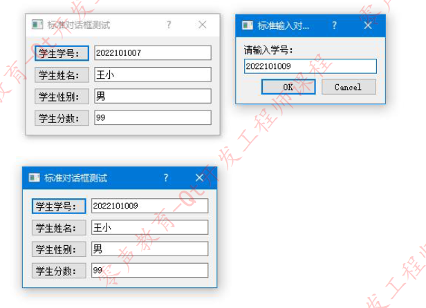

## Qt  QInputDialog 输入对话框实战

在 Qt 开发中，输入对话框是高频使用的组件之一，用于快速获取用户输入的文本、选择项等数据。Qt 提供的`QInputDialog`类封装了标准化的输入交互逻辑，支持自定义输入类型、提示信息和默认值，无需开发者从零构建界面，极大提升了开发效率。本文将结合学生信息管理的实战案例，详细讲解`QInputDialog`的核心用法、代码实现与功能扩展，帮助开发者快速上手。

## 一、QInputDialog 类核心介绍

### 1. 类的核心特性

`QInputDialog`是 Qt 提供的标准输入对话框类，隶属于 Qt Widgets 模块，主要特点包括：

- 支持多种输入类型：文本输入（单行 / 密码）、下拉列表选择、数值输入（整数 / 浮点数）等；
- 可自定义对话框标题、提示文本、默认值、输入验证规则；
- 自带`OK/Cancel`按钮，自动处理用户确认 / 取消逻辑，返回输入结果和操作状态；
- 无需手动布局控件，通过静态成员函数直接调用，代码简洁高效。

### 2. 核心接口说明

`QInputDialog`提供了多个静态成员函数，覆盖不同输入场景，常用接口如下：

|         接口函数         |                     功能描述                      |
| :----------------------: | :-----------------------------------------------: |
|       `getText()`        | 获取单行文本输入，支持设置输入模式（正常 / 密码） |
|       `getItem()`        |   提供下拉列表选择，支持设置可选列表、默认索引    |
| `getInt()`/`getDouble()` |     获取整数 / 浮点数输入，支持设置范围、步长     |
|   `getMultiLineText()`   |                 获取多行文本输入                  |

这些接口均返回用户输入的结果（如`QString`、`int`等），并通过传入的`bool*`参数返回操作状态（`true`表示用户点击 OK，`false`表示取消）。

## 二、实战案例

本文将实现一个学生信息管理界面，支持学号（文本输入）、性别（下拉选择）的修改功能，界面包含学号、姓名、性别、分数四个字段的显示与编辑入口，完全基于`QInputDialog`实现交互逻辑。

#### 头文件

首先在头文件中引入必要的头文件，声明界面布局、按钮、输入框等组件，以及处理输入的槽函数：

```cpp
#ifndef DIALOG_H
#define DIALOG_H
#include <QDialog>
#include <QGridLayout>
#include <QLineEdit>
#include <QPushButton>
#include <QInputDialog> // 引入QInputDialog头文件

class Dialog : public QDialog
{
    Q_OBJECT
public:
    Dialog(QWidget *parent = nullptr);
    ~Dialog();

private:
    // 布局管理器
    QGridLayout *glayout;
    // 按钮与输入框：学号、姓名、性别、分数
    QPushButton *inputstudentnobutton;
    QLineEdit *inputstudentnobuttonLineEdit;
    QPushButton *inputstudentnamebutton;
    QLineEdit *inputstudentnamebuttonLineEdit;
    QPushButton *inputstudentsexbutton;
    QLineEdit *inputstudentsexbuttonLineEdit;
    QPushButton *inputstudentscorebutton;
    QLineEdit *inputstudentscorebuttonLineEdit;

private slots:
    // 槽函数：处理学号修改
    void modifystudentno();
    // 槽函数：处理性别修改
    void modifystudentsex();
};

#endif // DIALOG_H
```

#### 源文件

在源文件中完成界面布局、组件初始化、信号槽连接，以及`QInputDialog`的核心调用逻辑：

```cpp
#include "dialog.h"

// 构造函数：初始化界面
Dialog::Dialog(QWidget *parent)
    : QDialog(parent)
{
    // 设置窗口大小和标题
    resize(260, 110);
    setWindowTitle("标准对话框测试");

    // 初始化网格布局
    glayout = new QGridLayout(this);

    // 初始化学号相关组件
    inputstudentnobutton = new QPushButton;
    inputstudentnobutton->setText("学生学号：");
    inputstudentnobuttonLineEdit = new QLineEdit("2022101001"); // 默认值

    // 初始化姓名相关组件
    inputstudentnamebutton = new QPushButton;
    inputstudentnamebutton->setText("学生姓名：");
    inputstudentnamebuttonLineEdit = new QLineEdit("王小"); // 默认值

    // 初始化性别相关组件
    inputstudentsexbutton = new QPushButton;
    inputstudentsexbutton->setText("学生性别：");
    inputstudentsexbuttonLineEdit = new QLineEdit("男"); // 默认值

    // 初始化分数相关组件
    inputstudentscorebutton = new QPushButton;
    inputstudentscorebutton->setText("学生分数：");
    inputstudentscorebuttonLineEdit = new QLineEdit("99"); // 默认值

    // 布局排列：行索引、列索引、行跨度、列跨度
    glayout->addWidget(inputstudentnobutton, 0, 0);
    glayout->addWidget(inputstudentnobuttonLineEdit, 0, 1);
    glayout->addWidget(inputstudentnamebutton, 1, 0);
    glayout->addWidget(inputstudentnamebuttonLineEdit, 1, 1);
    glayout->addWidget(inputstudentsexbutton, 2, 0);
    glayout->addWidget(inputstudentsexbuttonLineEdit, 2, 1);
    glayout->addWidget(inputstudentscorebutton, 3, 0);
    glayout->addWidget(inputstudentscorebuttonLineEdit, 3, 1);

    // 信号槽连接：按钮点击触发对应的槽函数
    connect(inputstudentnobutton, SIGNAL(clicked()), this, SLOT(modifystudentno()));
    connect(inputstudentsexbutton, SIGNAL(clicked()), this, SLOT(modifystudentsex()));
}

Dialog::~Dialog()
{}

// 槽函数：修改学号（文本输入）
void Dialog::modifystudentno()
{
    bool isOK; // 存储用户操作状态（OK/Cancel）
    // 调用QInputDialog::getText获取文本输入
    QString strText = QInputDialog::getText(
        this,                  // 父窗口
        "标准输入对话框",       // 对话框标题
        "请输入学号：",         // 提示文本
        QLineEdit::Normal,     // 输入模式（正常显示，可改为Password）
        inputstudentnobuttonLineEdit->text(), // 默认值（当前输入框内容）
        &isOK                  // 输出操作状态
    );

    // 判断用户是否点击OK且输入不为空
    if (isOK && !strText.isEmpty())
    {
        // 更新输入框显示
        inputstudentnobuttonLineEdit->setText(strText);
    }
}

// 槽函数：修改性别（下拉列表选择）
void Dialog::modifystudentsex()
{
    // 定义下拉列表选项
    QStringList strSexItems;
    strSexItems << "男" << "女";

    bool isOK;
    // 调用QInputDialog::getItem获取列表选择
    QString strSexItem = QInputDialog::getItem(
        this,                  // 父窗口
        "标准输入对话框",       // 对话框标题
        "请选择性别：",         // 提示文本
        strSexItems,           // 可选列表
        0,                     // 默认选中索引（0表示第一个选项）
        false,                 // 是否可编辑（false表示只能选择）
        &isOK                  // 输出操作状态
    );

    // 判断用户是否点击OK且选择不为空
    if (isOK && !strSexItem.isEmpty())
    {
        // 更新输入框显示
        inputstudentsexbuttonLineEdit->setText(strSexItem);
    }
}
```

