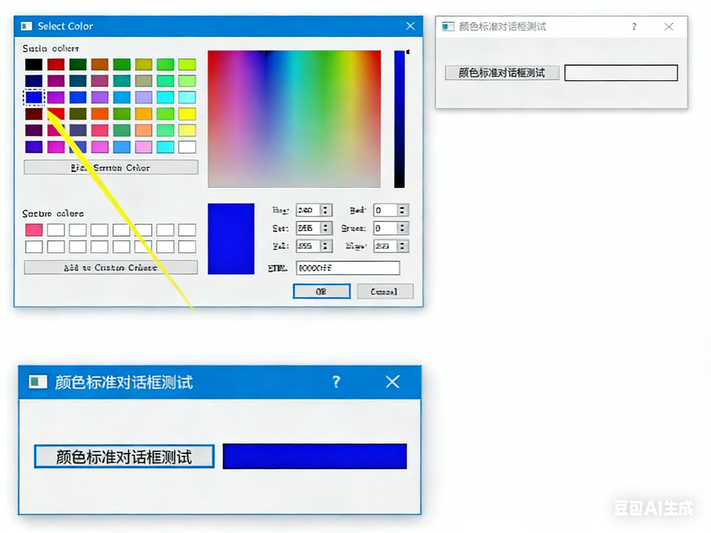

## Qt QColorDialog 类颜色对话框实战笔记

在 Qt 开发中，颜色选择是很多图形界面程序的常见需求。`QColorDialog` 类提供了跨平台的标准颜色对话框，能让用户直观地选择颜色，

**注意：不同系统平台显示风格虽有差异，但核心功能完全一致。**

## 一、QColorDialog 类基础信息

1. 类的作用:

    `QColorDialog`类提供标准颜色对话框组件，支持用户选择预设颜色或自定义颜色。

2. 头文件与模块:

   - 头文件：`#include <QColorDialog>`
   - `qmake` 配置：`QT += widgets`

3. 类的继承关系

   该类继承自 

   `QDialog`与`QFileDialog`、`QFontDialog`等同属 Qt 标准对话框组件家族。

## 二、程序代码实例

使用 `QColorDialog` 打开颜色选择对话框后，界面会包含这些核心区域：

1. **预设颜色区**：展示常用的基础颜色，用户可直接点击选择。
2. **自定义颜色区**：支持用户通过调整色相（Hue）、饱和度（Sat）、亮度（Yl），或是 RGB 三色数值，调配出个性化颜色。
3. **功能按钮**：提供 “OK”“Cancel” 等按钮，用于确认或取消颜色选择，还可将自定义颜色添加到收藏。

#### 头文件

```cpp
#ifndef DIALOG_H
#define DIALOG_H

#include <QDialog>


#include <QPushButton>
#include <QFrame>
#include <QColorDialog>
#include <QGridLayout>

class Dialog : public QDialog
{
    Q_OBJECT

public:
    Dialog(QWidget *parent = nullptr);
    ~Dialog();

private:
    QGridLayout *glayout;
    QPushButton *colorbutton;

    // QFrame类是基本控件的基类，QWidget是QFrame类型
    QFrame *colorFrame;

private slots:
    void dispcolorFunc();

};
#endif // DIALOG_H

```

#### 代码

```cpp
#include "dialog.h"

Dialog::Dialog(QWidget *parent)
    : QDialog(parent)
{

    setWindowTitle("颜色对话框测试");

    glayout=new QGridLayout(this);  // new一个布局对象

    colorbutton=new QPushButton("调用颜色对话框");
        
     // 创建框架控件，用于展示选中的颜色
    colorFrame=new QFrame;

    colorFrame->setFrameShape(QFrame::Box); // 设置形状
     // 启用框架的自动背景填充功能，否则无法显示背景色
    colorFrame->setAutoFillBackground(true); // 填充背景处理

    glayout->addWidget(colorbutton,0,0);
    glayout->addWidget(colorFrame,1,0);

    // 信号槽函数连接
    connect(colorbutton,SIGNAL(clicked()),this,SLOT(dispcolorFunc()));

}
Dialog::~Dialog()
{}

// 槽函数：打开颜色对话框并设置框架背景色
void Dialog::dispcolorFunc()
{
    // 打开颜色对话框，初始颜色设为红色，返回用户选中的颜色
    QColor colorvalues = QColorDialog::getColor(Qt::red);

    // 判断用户是否选择了有效颜色（点击OK返回有效，点击Cancel返回无效）
    if(colorvalues.isValid())
    {
        // 创建调色板对象，并将其颜色设置为选中的颜色
        QPalette palette(colorvalues);
        // 将调色板设置到框架上，框架背景色随之改变
        colorFrame->setPalette(palette);
    }
}
```



