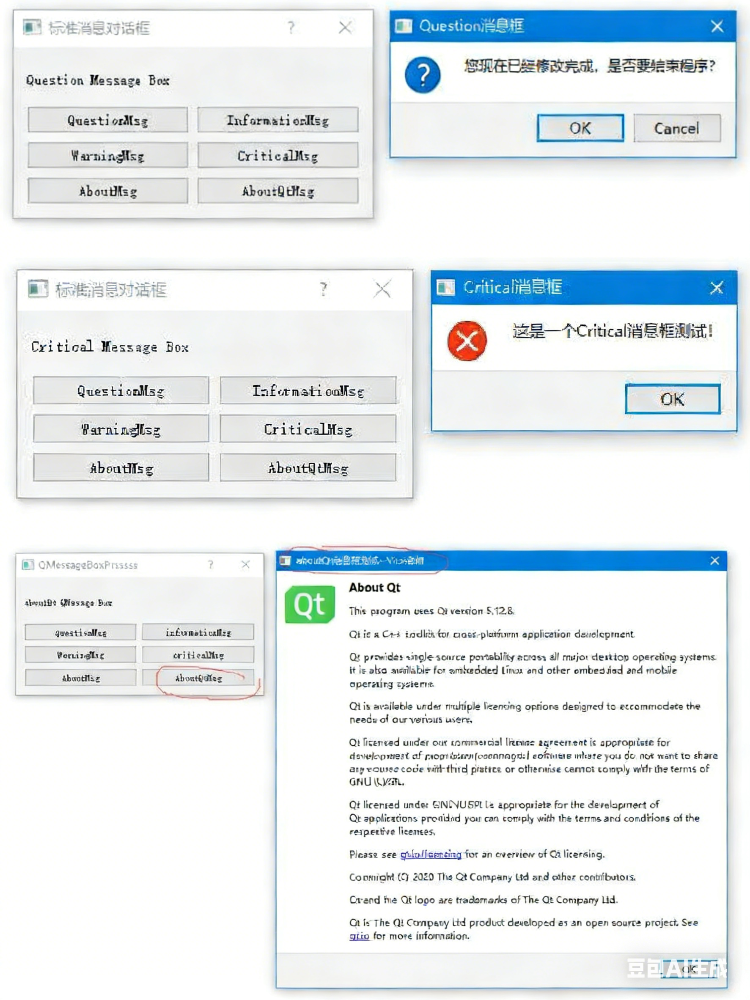

## Qt QMessageBox 类消息对话框实战

在 Qt 开发中，`QMessageBox` 是常用的模式对话框类，专门用于显示提示性消息，支持用户通过点击标准按钮完成交互响应。

## 一、QMessageBox 类基础信息

1. 类的作用

   **提供多种类型的标准消息对话框，用于展示问题、提示、警告、错误等信息，同时支持用户通过预设按钮进行操作反馈。**

2. 头文件与模块

   - 头文件：`#include <QMessageBox>`
   - qmake 配置：`QT += widgets`

3. 类的继承关系

   继承自 `QDialog`，`QFileDialog`、`QColorDialog`等同属 Qt 标准对话框组件。

## 二、代码案例

### 头文件

```cpp
#ifndef DIALOG_H
#define DIALOG_H

#include <QDialog>

#include <QLabel>
#include <QPushButton>
#include <QGridLayout>
#include <QMessageBox>

class Dialog : public QDialog
{
    Q_OBJECT

public:
    Dialog(QWidget *parent = nullptr);
    ~Dialog();

private:
    QGridLayout *glayout;

    QLabel *displabel;
    QPushButton *questionbutton; // 问题消息框命令按钮
    QPushButton *informationbutton; // 信息消息框命令按钮
    QPushButton *warningbutton; // 警告消息框命令按钮
    QPushButton *criticalbutton; // 错误消息框命令按钮
    QPushButton *aboutbutton; // 关于消息框命令按钮
    QPushButton *aboutqtbutton; //

private slots:
    void displayquestionMsg();
    void displayinformationMsg();
    void displaywarningMsg();
    void displaycriticalMsg();
    void displayaboutMsg();
    void displayaboutqtMsg();

};
#endif // DIALOG_H
```

### 源代码

```cpp
#include "dialog.h"

Dialog::Dialog(QWidget *parent)
    : QDialog(parent)
{
    resize(320,150);

    glayout=new QGridLayout(this);

    displabel=new QLabel("请你选择一个消息框");

    questionbutton=new QPushButton("questionMsg"); // 问题消息框命令按钮
    informationbutton=new QPushButton("informationMsg"); // 信息消息框命令按钮
    warningbutton=new QPushButton("warningMsg"); // 警告消息框命令按钮
    criticalbutton=new QPushButton("criticalMsg"); // 错误消息框命令按钮
    aboutbutton=new QPushButton("aboutMsg"); // 关于消息框命令按钮
    aboutqtbutton=new QPushButton("aboutQtMsg"); //


    glayout->addWidget(displabel,0,0,1,2);
    glayout->addWidget(questionbutton,1,0);
    glayout->addWidget(informationbutton,1,1);
    glayout->addWidget(warningbutton,2,0);
    glayout->addWidget(criticalbutton,2,1);
    glayout->addWidget(aboutbutton,3,0);
    glayout->addWidget(aboutqtbutton,3,1);


    connect(questionbutton,SIGNAL(clicked()),this,SLOT(displayquestionMsg()));
    connect(informationbutton,SIGNAL(clicked()),this,SLOT(displayinformationMsg()));
    connect(warningbutton,SIGNAL(clicked()),this,SLOT(displaywarningMsg()));
    connect(criticalbutton,SIGNAL(clicked()),this,SLOT(displaycriticalMsg()));
    connect(aboutbutton,SIGNAL(clicked()),this,SLOT(displayaboutMsg()));
    connect(aboutqtbutton,SIGNAL(clicked()),this,SLOT(displayaboutqtMsg()));

}

Dialog::~Dialog()
{}

// 展示Question类型消息框（询问类，带交互按钮）
void Dialog::displayquestionMsg()
{
    // 第一步：更新标签文本，提示当前操作的消息框类型
    displabel->setText("question QMessageBox");

    // 第二步：弹出Question消息框，并接收用户点击的按钮返回值
    // QMessageBox::question参数说明：
    // this → 父窗口（消息框居中显示）
    // "Question消息框" → 消息框标题
    // "你是否想退出程序应用，请选择?" → 消息框显示的内容
    // QMessageBox::Ok|QMessageBox::Cancel → 消息框显示的按钮组合（确定+取消）
    // QMessageBox::Ok → 默认选中的按钮（回车直接触发）
    switch(QMessageBox::question(this,"Question消息框",
                                 "你是否想退出程序应用，请选择?",QMessageBox::Ok|QMessageBox::Cancel,QMessageBox::Ok))
    {
    // 用户点击"确定"按钮
    case QMessageBox::Ok:
        displabel->setText("你选择questionMsg命令按钮当中的button/Ok!");
        break;
    // 用户点击"取消"按钮
    case QMessageBox::Cancel:
        displabel->setText("你选择questionMsg命令按钮当中的button/Cancel!");
        break;
    // 其他情况（极少出现，做容错处理）
    default:
        break;
    }
    return ;
}

// 展示Information类型消息框（提示类，仅确认按钮）
void Dialog::displayinformationMsg()
{
    // 更新标签文本，提示当前操作的消息框类型
    displabel->setText("information QMessageBox");
    
    // 弹出Information消息框（无返回值，仅展示提示信息）
    // 用途：展示无风险的提示性内容，用户只能点击"确定"关闭
    QMessageBox::information(this,"Information消息框","Information消息框测试成功，大家可以自己描述");
    return ;
}

// 展示Warning类型消息框（警告类，带多选项交互按钮）
void Dialog::displaywarningMsg()
{
    // 更新标签文本，提示当前操作的消息框类型
    displabel->setText("warning QMessageBox");

    // 弹出Warning消息框，接收用户点击的按钮返回值
    // 参数说明：
    // QMessageBox::Save|QMessageBox::Discard|QMessageBox::Cancel → 按钮组合（保存+放弃+取消）
    // QMessageBox::Save → 默认选中保存按钮
    switch(QMessageBox::warning(this,"Warning消息框",
                                "是否删除数据库sudent.mdb，请注意数据的操作安全?",
                                QMessageBox::Save|QMessageBox::Discard|QMessageBox::Cancel,QMessageBox::Save))
    {
    // 用户点击"保存"按钮
    case QMessageBox::Save:
        displabel->setText("你选择warningMsg命令按钮当中的button/Save!");
        break;
    // 用户点击"放弃"按钮
    case QMessageBox::Discard:
        displabel->setText("你选择warningMsg命令按钮当中的button/Discard!");
        break;
    // 用户点击"取消"按钮
    case QMessageBox::Cancel:
        displabel->setText("你选择warningMsg命令按钮当中的button/Cancel!");
        break;
    default:
        break;
    }
    return ;
}

// 展示Critical类型消息框（错误类，仅确认按钮）
void Dialog::displaycriticalMsg()
{
    // 更新标签文本，提示当前操作的消息框类型
    displabel->setText("critical QMessageBox");
    
    // 弹出Critical消息框（界面样式更醒目，用于展示严重错误）
    // 用途：展示程序运行错误、数据损坏等严重问题，仅可点击"确定"关闭
    QMessageBox::critical(this,"critical消息框","数据库文件备份错误，请重新检查？");
    return ;
}

// 展示About类型消息框（自定义关于框）
void Dialog::displayaboutMsg()
{
    // 更新标签文本，提示当前操作的消息框类型
    displabel->setText("about QMessageBox");
    
    // 弹出About消息框（可自定义内容，常用于展示程序版本、版权等信息）
    QMessageBox::about(this,"about消息框","测试Qt about消息框");
    return ;
}

// 展示AboutQt类型消息框（Qt内置关于框）
void Dialog::displayaboutqtMsg()
{
    // 更新标签文本，提示当前操作的消息框类型
    displabel->setText("aboutQt QMessageBox");
    
    // 弹出AboutQt消息框（Qt内置固定内容，展示Qt版本、版权、开发套件等信息）
    // 注意：标题参数仅作窗口标题，内容由Qt自动填充，无法自定义
    QMessageBox::aboutQt(this,"aboutQt消息框测试");
    return ;
}
```



**使用场景**：

- `Question`：询问用户是否执行操作（退出 / 删除）；
- `Information`：普通提示（操作成功）；
- `Warning`：风险操作提醒（删除数据）；
- `Critical`：严重错误提示（备份失败）；
- `About`：自定义程序说明；
- `AboutQt`：展示 Qt 版本信息。