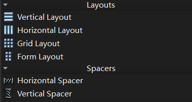
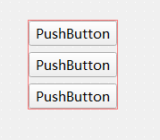
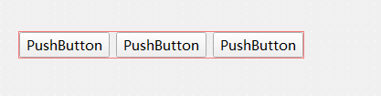
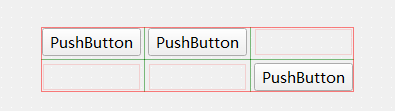
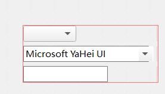
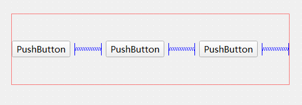
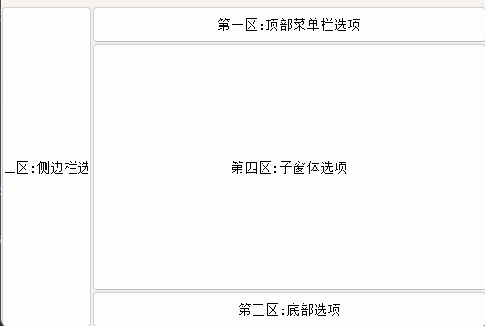
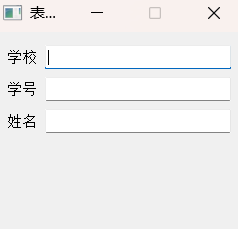

## Qt5 布局管理与空间间隔实用笔记：Layouts & Spacers 详解

在 Qt5 开发中，布局管理（Layouts）和空间间隔（Spacers）是实现界面组件有序排列、自适应窗口大小的核心工具。合理运用这些控件能让界面开发更高效、界面效果更专业。

## 一、核心控件分类与基础说明

Qt5 中常用的布局控件和空间间隔控件主要分为以下两类，各自承担不同的界面排列职责，如图所示：



### （一）布局控件（Layouts）

布局控件用于定义组件的排列规则，支持组件自动调整位置和大小，适配不同窗口尺寸：

1. **Vertical Layout（垂直布局）**：**组件沿垂直方向（从上到下）依次排列。**

   

2. **Horizontal Layout（横向 / 水平布局）**：**组件沿水平方向（从左到右）依次排列。**

   

3. **Grid Layout（网格 / 栅格布局）**：**将界面划分为多行多列的网状栅格，组件可占用单个或多个栅格单元，灵活性极高。**

   

4. **Form Layout（表单布局）**：**专门用于表单场景，默认将 “标签 + 输入组件” 成对排列，支持灵活的换行和对齐设置。**

   

### （二）空间间隔控件（Spacers）

空间间隔控件用于在组件之间或布局边缘添加空白区域，优化界面美观度，一般也叫**“弹簧”**：

1. **Horizontal Spacer（水平间隔）**：**在水平方向上填充空白，用于调整水平排列组件的间距。**
2. **Vertical Spacer（垂直间隔）**：**在垂直方向上填充空白，用于调整垂直排列组件的间距。**



## 二、重点布局控件代码详解

### （一）Grid Layout（网格布局）

#### 核心特点

**通过行和列划分界面，组件可指定占用的行数、列数，支持复杂界面布局（如顶部导航栏 + 侧边栏 + 主内容区 + 底部状态栏的组合）。**

#### 头文件（widget.h）

```cpp
#ifndef WIDGET_H
#define WIDGET_H

#include <QWidget>
#include <QGridLayout>  // 网格布局控件头文件
#include <QLabel>       // 标签控件头文件（本案例未直接使用，保留引用）
#include <QPushButton>  // 命令按钮控件头文件

class Widget : public QWidget
{
    Q_OBJECT

public:
    Widget(QWidget *parent = nullptr);
    ~Widget();

private:
    QGridLayout *pGrid_layouts;  // 网格布局指针
    QPushButton *button1;        // 按钮1（顶部菜单栏选项）
    QPushButton *button2;        // 按钮2（侧边栏选项）
    QPushButton *button3;        // 按钮3（底部选项）
    QPushButton *button4;        // 按钮4（子窗体选项）
};

#endif // WIDGET_H
```

#### 源文件（widget.cpp）

```cpp
#include "widget.h"

Widget::Widget(QWidget *parent)
    : QWidget(parent)
{
    // 初始化按钮组件
    button1 = new QPushButton(this);
    button1->setText("第一区:顶部菜单栏选项");
    button1->setFixedHeight(40);  // 设置固定高度
    // 设置大小策略：水平和垂直方向均自适应扩展
    button1->setSizePolicy(QSizePolicy::Expanding, QSizePolicy::Expanding);

    button2 = new QPushButton(this);
    button2->setText("第二区:侧边栏选项");
    button2->setFixedWidth(100);  // 设置固定宽度
    button2->setSizePolicy(QSizePolicy::Expanding, QSizePolicy::Expanding);

    button3 = new QPushButton(this);
    button3->setText("第三区:底部选项");
    button3->setFixedHeight(40);  // 设置固定高度
    button3->setSizePolicy(QSizePolicy::Expanding, QSizePolicy::Expanding);

    button4 = new QPushButton(this);
    button4->setText("第四区:子窗体选项");
    button4->setSizePolicy(QSizePolicy::Expanding, QSizePolicy::Expanding);

    // 初始化网格布局
    pGrid_layouts = new QGridLayout();

    // 设置布局边距（上、右、下、左），此处设为0（可根据需求调整）
    pGrid_layouts->setContentsMargins(0, 0, 0, 0);
    // 设置组件间距（此处设为0，默认有间距，可按需调整，如40）
    pGrid_layouts->setSpacing(0);

    // 向布局中添加组件：addWidget(组件, 开始行, 开始列, 占用行数, 占用列数, 对齐方式)
    pGrid_layouts->addWidget(button1, 0, 1);  // 按钮1：第0行第1列，占用1行1列
    pGrid_layouts->addWidget(button2, 0, 0, 3, 1);  // 按钮2：第0行第0列，占用3行1列（侧边栏贯穿顶部到底部）
    pGrid_layouts->addWidget(button3, 2, 1);  // 按钮3：第2行第1列，占用1行1列
    pGrid_layouts->addWidget(button4, 1, 1);  // 按钮4：第1行第1列，占用1行1列（主内容区）

    // 为当前窗口设置布局
    setLayout(pGrid_layouts);
}

Widget::~Widget()
{
    //  Qt 父对象会自动管理子组件内存，无需手动释放
}
```

#### 关键 API 说明

1. `setContentsMargins(int left, int top, int right, int bottom)`：设置布局边缘与窗口的边距。
2. `setSpacing(int spacing)`：设置布局中组件之间的间距。
3. `addWidget(QWidget *widget, int row, int column, int rowSpan = 1, int columnSpan = 1, Qt::Alignment alignment = Qt::Alignment())`：核心添加组件的方法，支持指定组件的位置和占用范围。

#### 展示：



### （二）Form Layout（表单布局）

#### 核心特点

**专为表单设计，默认一行包含 “标签 + 输入组件”，支持换行策略和标签对齐调整，适合实现登录、注册、信息填写等界面。**

#### 头文件（widget.h）

```cpp
#ifndef WIDGET_H
#define WIDGET_H

#include <QWidget>

class Widget : public QWidget
{
    Q_OBJECT

public:
    Widget(QWidget *parent = nullptr);
    ~Widget();
};

#endif // WIDGET_H
```

#### 源文件（widget.cpp）

```cpp
#include "widget.h"
#include <QFormLayout>  // 表单布局头文件
#include <QLineEdit>    // 单行输入框头文件

Widget::Widget(QWidget *parent)
    : QWidget(parent)
{
    // 设置窗口固定大小（宽250，高200）
    setFixedSize(250, 200);

    // 初始化表单布局
    QFormLayout *qLayout = new QFormLayout(this);

    // 初始化输入框组件
    QLineEdit *le1 = new QLineEdit();  // 用于输入学号
    QLineEdit *le2 = new QLineEdit();  // 用于输入姓名
    QLineEdit *le3 = new QLineEdit();  // 用于输入学校

    // 向表单布局添加行：addRow(标签文本, 输入组件)
    qLayout->addRow("学校", le3);
    qLayout->addRow("学号", le1);
    qLayout->addRow("姓名", le2);

    // 设置组件间距（标签与输入框、行与行之间的间距）
    qLayout->setSpacing(8);

    // 设置换行策略：WrapLongRows（标签过长时换行，默认同一行；WrapAllRows 标签显示在输入框上方）
    qLayout->setRowWrapPolicy(QFormLayout::WrapLongRows);

    // 设置标签对齐方式：左对齐（默认可能为右对齐，可按需调整）
    qLayout->setLabelAlignment(Qt::AlignLeft);

    // 设置窗口标题
    setWindowTitle("表单布局测试案例");
}

Widget::~Widget()
{
    // Qt 父对象自动管理内存，无需手动释放
}
```

#### 关键 API 说明

1. `addRow(const QString &labelText, QWidget *field)`：添加一行表单，包含标签和输入组件。
2. `setRowWrapPolicy(QFormLayout::RowWrapPolicy policy)`：设置换行策略，控制标签和输入组件的排列方式。
3. `setLabelAlignment(Qt::Alignment alignment)`：设置标签的对齐方式（如左对齐、右对齐）。
4. `setSpacing(int spacing)`：设置行与行之间、标签与输入组件之间的间距。

#### 展示：



## 五、总结

Qt5 的布局管理和空间间隔控件是界面开发的基础，掌握这些工具能大幅提升开发效率和界面适配性：

1. 简单排列（如按钮组、列表）可使用垂直 / 水平布局。
2. 复杂分区界面（如主窗口、控制台）优先使用网格布局。
3. 表单类界面（如登录、信息填写）首选表单布局。
4. 界面留白和组件位置微调可通过空间间隔控件实现。