## Qt5 常用控件笔记：Buttons & Containers 全解析

在 Qt5 界面开发中，命令按钮组（Buttons）和容器组（Containers）是构建交互界面的核心组件。命令按钮负责接收用户点击、选择等操作，容器控件则用于组织和管理界面元素，实现复杂界面的分层与布局。本文基于零声教育 vico 老师的课程内容，详细拆解两类控件的功能、用途及核心特性，帮助大家快速掌握实战用法。

## 一、Qt5 命令按钮组（Buttons）：交互操作的核心载体

命令按钮组是用户与程序交互的直接入口，每种按钮都有其特定的使用场景和交互逻辑，以下是常用按钮的详细说明：

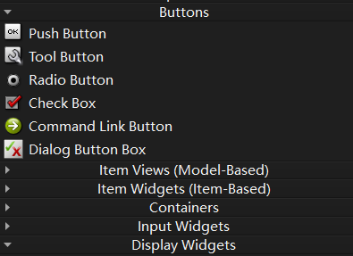

| 控件名称            | 中文释义     |                      核心功能与使用场景                      |
| :------------------ | :----------- | :----------------------------------------------------------: |
| Push Button         | 命令按钮     | 最基础、最常用的按钮控件，支持点击触发事件（如 “确定”“取消”“提交” 等操作）。可设置文本、图标，支持自定义样式，适用于绝大多数需要用户主动触发的场景。 |
| Tool Button         | 工具按钮     | **通常用于工具栏或状态栏，以图标为主、文本为辅（或无文本）**，占用空间小，适合快速访问常用功能（如软件中的 “新建”“打开”“保存” 工具图标）。支持悬停提示、下拉菜单等扩展功能。 |
| Radio Button        | 单选按钮     | 一组中只能选择一个，选中后会显示圆点标记，适用于 **“互斥选择**” 场景（如性别选择 “男 / 女”、登录方式选择 “密码登录 / 验证码登录”）。需配合 `QButtonGroup` 使用以实现互斥逻辑。 |
| Check Box           | 复选框按钮   | 支持多选，选中后显示勾选标记，可单独选择或取消，适用于 “**非互斥选择**” 场景（如兴趣爱好选择 “篮球 / 足球 / 排球”、设置选项 “自动保存 / 夜间模式”）。支持 “半选中” 状态（用于子选项部分选中的场景）。 |
| Command Link Button | 命令链接按钮 | **兼具按钮和链接的特性，外观类似带箭头的文本链接**，点击后触发指定操作，常用于引导用户执行下一步操作（如 “前往设置页面”“查看帮助文档”），比普通按钮更具引导性。 |
| Dialog Button Box   | 按钮盒       | **专门用于对话框的按钮容器**，内置 “确定”“取消”“应用”“重置” 等常用对话框按钮，支持自动布局（如默认右对齐），可快速构建标准化对话框，无需手动调整按钮间距和位置，提升界面一致性。 |

### 核心使用要点

1. 单选按钮（Radio Button）必须关联 `QButtonGroup` 才能实现互斥，否则多个单选按钮可同时选中；
2. 复选框（Check Box）可通过 `setTristate(true)` 开启 “半选中” 状态，满足复杂选择场景；
3. 工具按钮（Tool Button）建议搭配 `QToolBar` 使用，可自动适配工具栏样式，支持图标大小调整；
4. 按钮盒（Dialog Button Box）支持通过 `setStandardButtons()` 快速添加标准化按钮，如 `QDialogButtonBox::Ok | QDialogButtonBox::Cancel`。

### Push Button案例：

代码实现了一个 Qt 主窗口（`MainWindow`），窗口内放置两个固定位置的按钮，点击不同按钮会通过样式表修改主窗口的背景颜色。

点击「命令按钮 1」：窗口背景变为黄色（`rgba (255,255,0,100%)`）

点击「命令按钮 2」：窗口背景变为红色（`rgba (255,0,0,100%)`)

**头文件：`mainwindow.h`**

```cpp
#ifndef MAINWINDOW_H
#define MAINWINDOW_H

#include <QMainWindow>

#include <QPushButton>  // 引入QPushButton类对应的头文件


class MainWindow : public QMainWindow
{
    Q_OBJECT

public:
    MainWindow(QWidget *parent = nullptr);
    ~MainWindow();

private:
    // 声明两个QPushButton对象
    QPushButton *pb1,*pb2;


private slots:
    // 声明对象pb1 pb2的槽函数
    void pushbutton1_clicked();
    void pushbutton2_clicked();

};
#endif // MAINWINDOW_H

```

**代码：`mainwindow.cpp`**

```cpp
#include "mainwindow.h"

MainWindow::MainWindow(QWidget *parent)
    : QMainWindow(parent)
{
    // 设置窗口运行位置
    this->setGeometry(300,150,500,300);

    // 实例化两个命令按钮对象
    pb1=new QPushButton("命令按钮1",this);
    pb2=new QPushButton("命令按钮2",this);

    // 设置两个QPushButton对象的坐标位置
    pb1->setGeometry(20,20,150,50);
    pb2->setGeometry(20,90,150,50);

    // 与信号槽函数连接
    connect(pb1,SIGNAL(clicked()),this,SLOT(pushbutton1_clicked()));
    connect(pb2,SIGNAL(clicked()),this,SLOT(pushbutton2_clicked()));
}

MainWindow::~MainWindow()
{}

// 槽函数1：点击pb1时，设置主窗口背景为黄色
void MainWindow::pushbutton1_clicked()
{
    this->setStyleSheet("QMainWindow {background-color:rgba(255,255,0,100%);}");
}

// 槽函数2：点击pb2时，设置主窗口背景为红色
void MainWindow::pushbutton2_clicked()
{
    this->setStyleSheet("QMainWindow {background-color:rgba(255,0,0,100%);}");
}
```

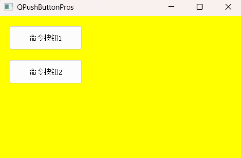

### Tool Button案例：

在主窗口中创建一个工具栏，并添加了一个带系统默认图标和文字的工具按钮

**头文件：`mainwindow.h`**

```cpp
#ifndef MAINWINDOW_H
#define MAINWINDOW_H

#include <QMainWindow>

// 1:
#include <QToolBar> // 引入QToolBar类
#include <QToolButton> // 引入QToolButton类


class MainWindow : public QMainWindow
{
    Q_OBJECT

public:
    MainWindow(QWidget *parent = nullptr);
    ~MainWindow();

private:
    // 2：声明一个QToolButton对象和QToolBar对象
    QToolBar *tbar;
    QToolButton *tbutton;

};
#endif // MAINWINDOW_H

```

**代码：`mainwindow.cpp`**

```cpp
#include "mainwindow.h"
#include <QApplication>  // 用于获取应用程序的样式
#include <QStyle>       // 用于访问系统内置样式/图标

MainWindow::MainWindow(QWidget *parent)
    : QMainWindow(parent)
{
    // 设置窗口位置（x=300,y=150）和尺寸（宽500,高300）
    this->setGeometry(300,150,500,300);

    // 实例化工具栏，父对象设为主窗口（自动管理内存）
    tbar=new QToolBar(this);
    // 固定工具栏的位置和尺寸（x=20,y=20，宽200,高50）
    tbar->setGeometry(20,20,200,50);

    // 获取应用程序的系统样式（与当前操作系统风格一致）
    QStyle *sty=QApplication::style();
    // 通过样式获取系统内置的“帮助”图标（SP_TitleBarContextHelpButton是帮助图标标识）
    QIcon ico=sty->standardIcon(QStyle::SP_TitleBarContextHelpButton);

    // 实例化工具按钮（未指定父对象，后续添加到工具栏后由工具栏管理）
    tbutton=new QToolButton();
    tbutton->setIcon(ico);                // 设置按钮图标
    tbutton->setText("系统帮助提示");      // 设置按钮文字
    tbutton->setToolButtonStyle(Qt::ToolButtonTextUnderIcon); // 文字在图标下方
    tbar->addWidget(tbutton);             // 将按钮添加到工具栏
}

MainWindow::~MainWindow()
{}
```

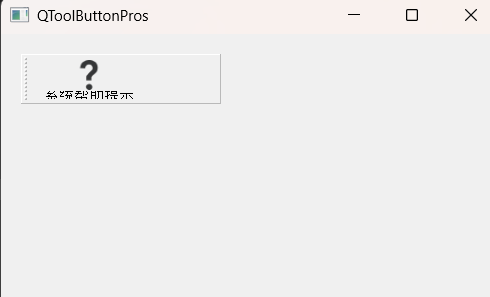

### Radio Button案例：

实例化两个 `QRadioButton`（单选按钮），固定位置显示。设置按钮文本，并指定第一个按钮默认选中、第二个未选中。

**头文件：`mainwindow.h`**

```cpp
#ifndef MAINWINDOW_H
#define MAINWINDOW_H

#include <QMainWindow>

#include <QRadioButton>

class MainWindow : public QMainWindow
{
    Q_OBJECT

public:
    MainWindow(QWidget *parent = nullptr);
    ~MainWindow();

private:
    // 声明2个QRadioButton对象 radb1,radb2;
    QRadioButton *radb1,*radb2;

};
#endif // MAINWINDOW_H
```

**代码：`mainwindow.cpp`**

```cpp
#include "mainwindow.h"

MainWindow::MainWindow(QWidget *parent)
    : QMainWindow(parent)
{
    // 设置窗口运行位置
    this->setGeometry(300,150,500,300);

    this->setStyleSheet("QMainWindow {background-color:rgba(255,255,255,100%);}");

    // 将QRadioButton类的两个对象进行实例化
    radb1 = new QRadioButton(this);
    radb2 = new QRadioButton(this);

    // 设置两个对象位置
    radb1->setGeometry(20,20,150,40);
    radb2->setGeometry(20,80,150,40);

    // 设置两个单选按钮文本
    radb1->setText("选择按钮1");
    radb2->setText("选择按钮2");

    // 设置命令按钮默认值Checked false true
    radb1->setChecked(true);
    radb2->setChecked(false);
}

MainWindow::~MainWindow()
{}
```

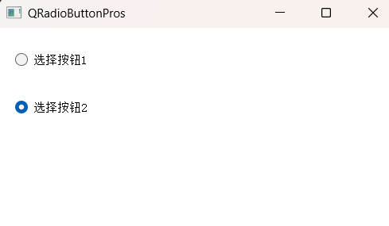

### Check Box案例：

创建复选框并开启三态模式（`setTristate()`），初始化为 “选中” 状态；

监听复选框状态变化（`stateChanged` 信号），根据状态（选中 / 未选中 / 半选中）动态修改按钮文本。

**头文件：`mainwindow.h`**

```cpp
#ifndef MAINWINDOW_H
#define MAINWINDOW_H

#include <QMainWindow>

#include <QCheckBox>

class MainWindow : public QMainWindow
{
    Q_OBJECT

public:
    MainWindow(QWidget *parent = nullptr);
    ~MainWindow();


private:
    // 声明1个QCheckBox对象
    QCheckBox *cb;

private slots:
    // 声明QCheckBox槽函数，在操作过程当中并且带参数传递，通过这个参数接收信号
    void checkboxstate(int);

};
#endif // MAINWINDOW_H

```

**代码：`mainwindow.cpp`**

```cpp
#include "mainwindow.h"

MainWindow::MainWindow(QWidget *parent)
    : QMainWindow(parent)
{
    // 设置窗口运行位置
    this->setGeometry(400,300,500,300);

    this->setStyleSheet("QMainWindow {background-color:rgba(255,100,0,100%);}");


    // 实例化操作
    cb=new QCheckBox(this);
    cb->setGeometry(30,50,250,50);

    cb->setCheckState(Qt::Checked); // 初始化三态复选框状态：Checked
    cb->setText("初始化状态为：Checked状态");

    cb->setTristate(); // 开启三态模式，必须开启。否则 只有两种状态（Checked Unchecked）

    connect(cb,SIGNAL(stateChanged(int)),this,SLOT(checkboxstate(int)));
}

MainWindow::~MainWindow()
{}

void MainWindow::checkboxstate(int istate)
{
    // 判断checkbox的状态
    switch(istate)
    {
    case Qt::Checked: // 选中状态
        cb->setText("选中状态OK");
        break;

    case Qt::Unchecked: // 未选中状态
        cb->setText("未选中状态NO");
        break;

    case Qt::PartiallyChecked: // 半选中状态
        cb->setText("半选中状态OK");
        break;

    default:
        break;
    }
}
```

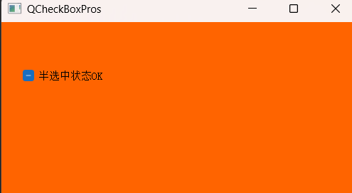

### Radio Button案例：

实例化 `QCommandLinkButton`（命令链接按钮），固定位置显示，设置按钮文本和描述；

绑定按钮点击信号，触发槽函数：通过 `QDesktopServices` 打开新浪官网。

**头文件：`mainwindow.h`**

```cpp
#ifndef MAINWINDOW_H
#define MAINWINDOW_H

#include <QMainWindow>

#include <QCommandLinkButton>

class MainWindow : public QMainWindow
{
    Q_OBJECT

public:
    MainWindow(QWidget *parent = nullptr);
    ~MainWindow();

private:
    // 声明一个QCommandLinkButton对象
    QCommandLinkButton *clb;

private slots:
    // 声明槽函数 使用鼠标点击clb之后触发
    void clbClicked();
};
#endif // MAINWINDOW_H
```

**代码：`mainwindow.cpp`**

```cpp
#include "mainwindow.h"
#include <QDesktopServices> // 提供桌面服务（如打开URL、文件等）
#include <QUrl>             // 处理URL地址的类

MainWindow::MainWindow(QWidget *parent)
    : QMainWindow(parent)
{
    // 设置窗口位置(x=400,y=300)和尺寸(宽500,高300)
    this->setGeometry(400,300,500,300);
    // 设置主窗口背景为橙红色（rgba：红255，绿100，蓝0，不透明）
    this->setStyleSheet("QMainWindow {background-color:rgba(255,100,0,100%);}");

    // 实例化命令链接按钮：参数依次是「主文本」「描述文本」「父对象」
    clb=new QCommandLinkButton("testclb","clicked testclb",this);
    // 固定按钮位置和尺寸
    clb->setGeometry(50,100,250,60);

    // 绑定信号槽：按钮点击时触发clbClicked槽函数
    connect(clb,SIGNAL(clicked()),this,SLOT(clbClicked()));
}

MainWindow::~MainWindow()
{}

// 按钮点击的槽函数：打开新浪网站
void MainWindow::clbClicked()
{
    // QDesktopServices::openUrl：调用系统默认浏览器打开指定URL
    QDesktopServices::openUrl(QUrl("https://www.sina.com.cn/"));
}
```

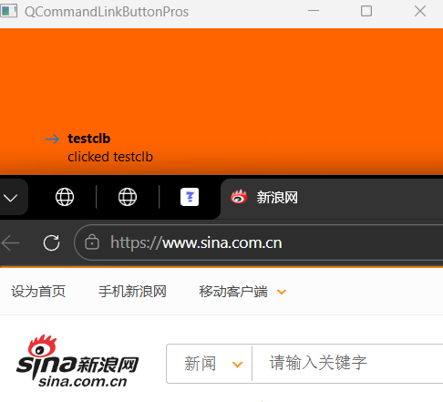

### Dialog Button Box案例：

创建固定位置的按钮盒，添加系统预设的 “取消” 按钮并修改其显示文本；

自定义一个 “自定义” 按钮，添加到按钮盒并指定其角色为 `ActionRole`；

绑定按钮盒的点击信号，通过判断点击的按钮对象，输出对应的调试信息。

**头文件：`mainwindow.h`**

```cpp
#ifndef MAINWINDOW_H
#define MAINWINDOW_H

#include <QMainWindow>

#include <QDialogButtonBox>
#include <QPushButton>

class MainWindow : public QMainWindow
{
    Q_OBJECT

public:
    MainWindow(QWidget *parent = nullptr);
    ~MainWindow();

private:
    // 声明两个对象
    QDialogButtonBox *dbb;
    QPushButton *pb;

private slots:
    // 声明信号槽
    void dbbpbClicked(QAbstractButton *);
};
#endif // MAINWINDOW_H
```

**代码：`mainwindow.cpp`**

```cpp
#include "mainwindow.h"
#include <QtDebug> // 用于调试输出（qDebug()）

MainWindow::MainWindow(QWidget *parent)
    : QMainWindow(parent)
{
    // 设置窗口位置(x=0,y=0)和尺寸(宽800,高600)
    this->setGeometry(0,0,800,600);

    // 实例化对话框按钮盒，父对象为主窗口
    dbb=new QDialogButtonBox(this);
    // 固定按钮盒位置和尺寸
    dbb->setGeometry(300,200,200,30);

    // 添加系统预设的“取消”按钮到按钮盒
    dbb->addButton(QDialogButtonBox::Cancel);
    // 修改“取消”按钮的显示文本（默认是“Cancel”，改为“取 消”）
    dbb->button(QDialogButtonBox::Cancel)->setText("取 消");

    // 实例化自定义按钮（无父对象，后续添加到按钮盒）
    pb=new QPushButton("自定义");

    // 将自定义按钮添加到按钮盒，并指定按钮角色为ActionRole
    dbb->addButton(pb,QDialogButtonBox::ActionRole);

    // 绑定信号槽：按钮盒内任意按钮点击时，触发dbbpbClicked槽函数
    connect(dbb,SIGNAL(clicked(QAbstractButton*)),this,
            SLOT(dbbpbClicked(QAbstractButton*)));
}

MainWindow::~MainWindow()
{}

// 按钮盒点击的槽函数：判断点击的按钮并输出调试信息
void MainWindow::dbbpbClicked(QAbstractButton *bt)
{
    // 判断是否点击了“取消”按钮
    if(bt==dbb->button(QDialogButtonBox::Cancel))
    {
      qDebug()<<"你已经点击【取消】按钮"<<endl;
    }
    // 判断是否点击了自定义按钮
    else if(bt==pb)
    {
        qDebug()<<"你已经点击【自定义】按钮"<<endl;
    }
}
```

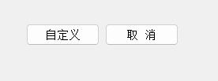

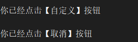


## 二、Qt5 容器组控件（Containers）：界面元素的组织与管理

容器控件的核心作用是 “承载和管理其他控件”，通过容器可实现界面的分层、分组、滚动、切换等功能，让复杂界面结构更清晰，以下是常用容器的详细说明（粗体代表常用）：

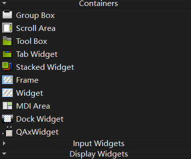

|    控件名称     |     中文释义     |                      核心功能与使用场景                      |
| :-------------: | :--------------: | :----------------------------------------------------------: |
|  **Group Box**  |      组合框      | **提供带有标题的框架**，用于将相关控件分组（如 “用户信息” 组包含姓名、年龄输入框），支持折叠 / 展开功能，使界面分区明确，提升可读性。常用于表单、设置页面的控件分组。 |
| **Scroll Area** |     滚动区域     | 当控件内容超出显示范围时，自动生成滚动条（水平 / 垂直），支持内容滚动查看，适用于文本较多的输入框、列表、图片预览等场景（如日志查看窗口、长文本编辑区域）。 |
|    Tool Box     |      工具箱      | 类似 “抽屉式” 布局，包含多个标签页，每个标签页对应一个工具面板，点击标签可切换显示不同面板，适用于需要容纳多个工具组的场景（如绘图软件的 “画笔工具”“颜色工具” 面板）。 |
| **Tab Widget**  |    标签小部件    | 最常用的切换容器，通过顶部 / 底部标签页切换不同内容区域（如浏览器的多标签页、软件的 “基本设置 / 高级设置” 页面）。支持添加、删除标签页，可自定义标签样式和位置。 |
| Stacked Widget  |     堆叠部件     | 多个页面堆叠在一起，同一时间仅显示一个页面，通过代码控制页面切换（无默认标签页导航），适用于需要 “隐式切换” 的场景（如步骤向导、根据用户操作动态切换的内容区域）。常与 `QListWidget` 或按钮配合实现导航。 |
|    **Frame**    |       框架       | 基础容器控件，提供一个简单的边框框架，可用于划分界面区域、包裹单个控件（如给图片添加边框），支持自定义边框样式、背景色，是构建复杂界面的 “基础积木”。 |
|     Widget      |      小部件      | Qt 中所有可视化控件的基类，本身可作为容器使用，用于承载其他控件并组织布局（如主窗口中的子界面、自定义控件的容器）。几乎所有复杂界面都是以 `QWidget` 为基础构建的。 |
|    MDI Area     |     MDI 区域     | 多文档界面（Multiple Document Interface）容器，支持在主窗口中打开多个子窗口（如办公软件的多文档编辑、IDE 的多文件编辑），子窗口可拖拽、最大化、最小化，支持层叠或平铺排列。 |
| **Dock Widget** |   停靠窗体部件   | 可停靠在主窗口边缘或浮动的容器，支持拖拽调整位置（如 VS Code 的侧边栏、Qt Creator 的 “项目”“输出” 面板）。常用于放置辅助功能模块，不占用主内容区域，提升界面灵活性。 |
|    QAxWidget    | ActiveX 控件封装 | 用于封装 ActiveX 控件（如 Flash 插件、Office 组件），使 Qt 程序能够集成第三方 ActiveX 控件的功能，适用于需要兼容旧版 ActiveX 组件的场景（注意：仅支持 Windows 平台）。 |

### 核心使用要点

1. 堆叠部件（Stacked Widget）无默认导航，需通过 `setCurrentIndex(int index)` 或 `setCurrentWidget(QWidget *widget)` 切换页面；
2. 停靠窗体（Dock Widget）可通过 `setAllowedAreas()` 设置允许停靠的方向（如仅允许左右停靠），通过 `setFloating(true)` 设置为浮动窗口；
3. 滚动区域（Scroll Area）需设置 `setWidget(QWidget *widget)` 指定承载的内容控件，且内容控件的大小需大于滚动区域才能显示滚动条；
4. 组合框（Group Box）可通过 `setCheckable(true)` 开启折叠功能，点击标题栏的复选框即可折叠 / 展开组内控件。


### Group Box案例

这段代码的核心是用**布局管理器 + 组合框**组织各类按钮，实现了以下关键功能：

- 4 个 `QGroupBox` 分别封装 “单选按钮组”“复选按钮组”“混合按钮组”“综合按钮组”；
- 用 `QVBoxLayout` 实现每个组合框内按钮的垂直排列；
- 用 `QGridLayout` 实现 4 个组合框的 2x2 网格布局；
- 进阶特性：可折叠组合框（`setCheckable(true)`）、带子菜单的普通按钮、默认选中的复选 / 普通按钮。

**头文件：`widget.h`**

```cpp
#ifndef WIDGET_H
#define WIDGET_H
#include <QWidget>
class Widget : public QWidget
{
    Q_OBJECT
public:
    Widget(QWidget *parent = nullptr);
    ~Widget();
};
#endif // WIDGET_H
```

**代码：`widget.cpp`**

```cpp
#include "widget.h"

// 引入所需的Qt控件头文件
#include <QGroupBox>       // 组合框（用于分组管理控件）
#include <QRadioButton>    // 单选按钮
#include <QPushButton>     // 普通按钮
#include <QCheckBox>       // 复选按钮
#include <QVBoxLayout>     // 垂直布局（控件垂直排列）
// 垂直布局管理器：将控件沿垂直方向从上到下排列；QVBoxLayout（垂直）和QHBoxLayout（水平）均继承自QBoxLayout

#include <QGridLayout>     // 网格布局（控件按行列排列）
#include <QMenu>           // 菜单类（用于给按钮添加下拉菜单）

Widget::Widget(QWidget *parent)
    : QWidget(parent)
{
    // ===================== 第一部分：创建第一个组合框（单选按钮组1） =====================
    // 1. 创建组合框对象，设置标题为"单选按钮组1"
    QGroupBox *gpb_1=new QGroupBox("单选按钮组1");
    // 2. 创建3个单选按钮对象
    QRadioButton *rbtn_1=new QRadioButton("RadioButton1");
    QRadioButton *rbtn_2=new QRadioButton("RadioButton2");
    QRadioButton *rbtn_3=new QRadioButton("RadioButton3");

    // 3. 创建垂直布局对象（用于将单选按钮垂直排列）
    QVBoxLayout *vbly1=new QVBoxLayout;
    // 4. 将3个单选按钮添加到垂直布局中
    vbly1->addWidget(rbtn_1);
    vbly1->addWidget(rbtn_2);
    vbly1->addWidget(rbtn_3);
    // 5. 将垂直布局设置为组合框的布局（组合框内的控件按此布局排列）
    gpb_1->setLayout(vbly1);


    // ===================== 第二部分：创建第二个组合框（复选按钮组2） =====================
    // 1. 创建组合框对象，设置标题为"复选按钮组2"
    QGroupBox *gpb_2=new QGroupBox("复选按钮组2");
    // 2. 创建3个复选按钮对象
    QCheckBox *cbx1=new QCheckBox("checkbox1");
    QCheckBox *cbx2=new QCheckBox("checkbox2");
    QCheckBox *cbx3=new QCheckBox("checkbox3");

    // 注释说明：开启三态模式后复选框支持全选、半选、未选三种状态（当前注释未启用）
    // cbx2->setTristate(true); 
    // 设置cbx2默认选中状态
    cbx2->setChecked(true);

    // 3. 创建垂直布局并添加3个复选按钮
    QVBoxLayout *vbly2=new QVBoxLayout;
    vbly2->addWidget(cbx1);
    vbly2->addWidget(cbx2);
    vbly2->addWidget(cbx3);
    // 4. 将布局绑定到组合框
    gpb_2->setLayout(vbly2);


    // ===================== 第三部分：创建第三个组合框（混合按钮组3） =====================
    // 1. 创建组合框对象，设置标题为"单选按钮和复选按钮组3"
    QGroupBox *gpb_3=new QGroupBox("单选按钮和复选按钮组3");
    // 设置组合框可勾选（标题栏出现复选框，点击可折叠/展开组合框内控件）
    gpb_3->setCheckable(true);

    // 2. 创建3个单选按钮和1个复选按钮
    QRadioButton *rbtn_31=new QRadioButton("RadioButton31");
    QRadioButton *rbtn_32=new QRadioButton("RadioButton32");
    QRadioButton *rbtn_33=new QRadioButton("RadioButton33");
    QCheckBox *cbx4=new QCheckBox("checkbox4");
    // 设置cbx4默认选中
    cbx4->setChecked(true);

    // 3. 创建垂直布局并添加所有按钮
    QVBoxLayout *vbly3=new QVBoxLayout;
    vbly3->addWidget(rbtn_31);
    vbly3->addWidget(rbtn_32);
    vbly3->addWidget(rbtn_33);
    vbly3->addWidget(cbx4);
    // 4. 绑定布局到组合框
    gpb_3->setLayout(vbly3);


    // ===================== 第四部分：创建第四个组合框（综合按钮组4） =====================
    // 1. 创建组合框对象，设置标题为"综合按钮组4"
    QGroupBox *gpb_4=new QGroupBox("综合按钮组4");
    // 开启组合框可勾选（折叠/展开功能）
    gpb_4->setCheckable(true);
    // 设置组合框默认勾选（默认展开状态）
    gpb_4->setChecked(true);

    // 2. 创建3个普通按钮
    QPushButton *pbtn_4=new QPushButton("PushButton4");
    QPushButton *pbtn_5=new QPushButton("PushButton5");
    // 设置pbtn_5可勾选（点击后保持按下状态，再次点击恢复，类似开关）
    pbtn_5->setCheckable(true);
    // 设置pbtn_5默认选中（按下状态）
    pbtn_5->setChecked(true);
    QPushButton *pbtn_6=new QPushButton("PushButton6");

    // 3. 给pbtn_6添加下拉菜单
    // 创建菜单对象，父对象绑定为当前Widget（自动管理内存）
    QMenu *mu=new QMenu(this);
    // 给菜单添加4个动作选项
    mu->addAction("King");
    mu->addAction("Darren");
    mu->addAction("Mark");
    mu->addAction("Vico");
    // 将菜单绑定到pbtn_6（点击按钮会弹出下拉菜单）
    pbtn_6->setMenu(mu);

    // 4. 创建垂直布局并添加3个按钮
    QVBoxLayout *vbly4=new QVBoxLayout;
    vbly4->addWidget(pbtn_4);
    vbly4->addWidget(pbtn_5);
    vbly4->addWidget(pbtn_6);
    // 5. 绑定布局到组合框
    gpb_4->setLayout(vbly4);


    // ===================== 第五部分：全局布局（网格布局） =====================
    // 1. 创建网格布局对象（按行列排列控件）
    QGridLayout *gdlyout = new QGridLayout;
    // 2. 将4个组合框添加到网格布局的指定位置：
    // addWidget(控件, 行, 列, 占用行数, 占用列数)
    gdlyout->addWidget(gpb_1,0,0,1,1);  // gpb_1 → 第0行第0列，占1行1列
    gdlyout->addWidget(gpb_2,0,1,1,1);  // gpb_2 → 第0行第1列，占1行1列
    gdlyout->addWidget(gpb_3,1,0,1,1);  // gpb_3 → 第1行第0列，占1行1列
    gdlyout->addWidget(gpb_4,1,1,1,1);  // gpb_4 → 第1行第1列，占1行1列

    // 3. 将网格布局设置为当前Widget的主布局（所有控件按此布局排列）
    this->setLayout(gdlyout);
}

// 析构函数（空实现，Qt父对象会自动释放所有子控件内存）
Widget::~Widget()
{
}
```

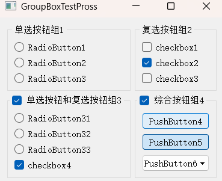

### **Scroll Area**案例

在滚动区域（`QScrollArea`）中显示一张图片，并且自定义了滚动条的显示策略（水平滚动条始终显示、垂直滚动条隐藏），同时让图片在滚动区域居中显示

**代码：`main.cpp`**

```cpp
#include "widget.h"

#include <QApplication>  // Qt应用程序核心类，负责事件循环、参数处理等

#include <QLabel>        // 标签控件：用于显示文本/图片
#include <QScrollArea>   // 滚动区域控件：给内容添加滚动条（内容超出区域时可滚动）
#include <QGridLayout>   // 网格布局：用于排列控件（此处仅放一个滚动区域）

int main(int argc, char *argv[])
{
    QApplication a(argc, argv);
  
    Widget w;

    // 设置主窗口初始尺寸（宽300，高200）
    w.resize(300,200);

    /*
     * 注释说明：
     * QScrollArea的核心功能继承自QAbstractScrollArea（抽象滚动区域基类）
     * 滚动条的外观/行为由滚动条策略（ScrollBarPolicy）控制，可通过Qt官网查询更多配置
     * */

    // 创建QLabel对象：用于承载图片显示
    QLabel *qljpg=new QLabel;
    // 设置QLabel的内容自动缩放：图片会适配QLabel的尺寸（否则图片超出Label会被裁剪）
    qljpg->setScaledContents(true);
    // 加载图片：路径为Qt资源文件中的 ":/new/prefix1/images/789.jpg"
    QImage imagejpg(":/new/prefix1/images/789.jpg");
    // 将QImage转换为QPixmap并设置到QLabel上（QLabel显示图片需用QPixmap）
    qljpg->setPixmap(QPixmap::fromImage(imagejpg));

    // 创建滚动区域对象：给图片添加滚动功能
    QScrollArea *sArea=new QScrollArea;

    // 设置滚动区域内的控件（此处是QLabel）居中显示
    sArea->setAlignment(Qt::AlignCenter);

    // 注释说明：启用后，滚动区域的子控件会自动适配滚动区域的尺寸（取消注释则图片随滚动区域缩放）
    // sArea->setWidgetResizable(true);

    // 设置滚动条策略：
    // 水平滚动条始终显示（即使图片宽度≤滚动区域宽度）
    sArea->setHorizontalScrollBarPolicy(Qt::ScrollBarAlwaysOn);
    // 垂直滚动条始终隐藏（即使图片高度>滚动区域高度）
    sArea->setVerticalScrollBarPolicy(Qt::ScrollBarAlwaysOff);

    // 将承载图片的QLabel设置为滚动区域的核心控件（滚动区域只包裹一个核心控件）
    sArea->setWidget(qljpg);

    // 创建网格布局对象：用于将滚动区域添加到主窗口
    QGridLayout *glayout=new QGridLayout;
    // 将滚动区域添加到网格布局（默认第0行第0列，占1行1列）
    glayout->addWidget(sArea);
    w.setLayout(glayout);
    
    w.show();
    return a.exec();
}
```

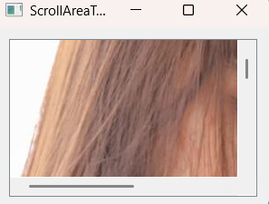


### **Tab Widget**案例

**头文件：`widget.h`**

```cpp
#ifndef WIDGET_H
#define WIDGET_H
#include <QWidget>
#include <QTabWidget>
#include <QGridLayout>
#include <QLabel>
#include <QPushButton>
#include <QLineEdit>
#include <QMessageBox>

class Widget : public QWidget
{
    Q_OBJECT

public:
    Widget(QWidget *parent = nullptr);
    ~Widget();

private:
    QTabWidget *tabWidgetUI;

private slots:
    void MsgCommit();
};
#endif // WIDGET_H

```

**代码：`widget.cpp`**

```cpp
#include "widget.h"

// 构造函数：初始化Widget窗口及标签页控件
Widget::Widget(QWidget *parent)
    : QWidget(parent)
{
    // 1. 设置主窗口标题
    this->setWindowTitle("标签小部件控件测试");
    // 2. 设置主窗口初始位置和尺寸：x=300, y=200, 宽600, 高400
    this->setGeometry(300,200,600,400);

    // 3. 创建QTabWidget（标签页控件），父对象设为主窗口（自动管理内存）
    tabWidgetUI=new QTabWidget(this);
    // 4. 设置标签页控件的位置和尺寸：x=20, y=20, 宽560, 高360
    tabWidgetUI->setGeometry(20,20,560,360);
    // 5. 显示标签页控件（父窗口show后也会显示，此处显式调用更直观）
    tabWidgetUI->show();

    // 6. 定义4个布尔变量，控制对应标签页是否显示
    bool m_showtabwidgetui1=true;  // 控制“进程”标签页
    bool m_showtabwidgetui2=true;  // 控制“性能”标签页
    bool m_showtabwidgetui3=true;  // 控制“应用历史记录”标签页
    bool m_showtabwidgetui4=true;  // 控制“启动”标签页

    // ===================== 第一个标签页：进程 =====================
    if(m_showtabwidgetui1)
    {
        // 创建标签页对应的内容窗口（QTabWidget的每个标签页需绑定一个QWidget）
        QWidget *qwidget1=new QWidget();
        // 将该窗口添加为标签页，标题为“进程”
        tabWidgetUI->addTab(qwidget1,"进程");

        // 创建网格布局（用于排列标签页内的控件）
        QGridLayout *glayout=new QGridLayout();

        // 创建标签控件：显示提示文本
        QLabel *lab1=new QLabel("请选择文件及文件夹：");
        // 创建单行输入框：用于输入/显示文本
        QLineEdit *ledit1=new QLineEdit();

        // 创建普通按钮：显示文本“消息框...”
        QPushButton *pbt1=new QPushButton("消息框...");
        // 绑定信号槽：按钮点击时触发MsgCommit()槽函数
        connect(pbt1,SIGNAL(clicked(bool)),this,SLOT(MsgCommit()));

        // 将控件添加到网格布局的指定位置：
        // addWidget(控件, 行, 列)
        glayout->addWidget(lab1,0,0);    // lab1 → 第0行第0列
        glayout->addWidget(ledit1,0,1);  // ledit1 → 第0行第1列
        glayout->addWidget(pbt1,0,2);    // pbt1 → 第0行第2列

        // 将网格布局设置为qwidget1的布局（标签页内控件按此布局排列）
        qwidget1->setLayout(glayout);
    }

    // ===================== 第二个标签页：性能 =====================
    if(m_showtabwidgetui2)
    {
        QWidget *qwidget2=new QWidget();
        tabWidgetUI->addTab(qwidget2,"性能"); 
    }

    // ===================== 第三个标签页：应用历史记录 =====================
    if(m_showtabwidgetui3)
    {
        QWidget *qwidget3=new QWidget();
        tabWidgetUI->addTab(qwidget3,"应用历史记录"); 
    }

    // ===================== 第四个标签页：启动 =====================
    if(m_showtabwidgetui4)
    {
        QWidget *qwidget4=new QWidget();
        tabWidgetUI->addTab(qwidget4,"启动"); 
    }

}
Widget::~Widget()
{
}

// 槽函数：按钮点击时弹出提示框
void Widget::MsgCommit()
{
    // 弹出信息提示框：
    // 参数说明：父窗口(NULL=无父窗口)、标题、内容、按钮（仅OK按钮）
    QMessageBox::information(NULL,"testing","QMessageBox：命令按钮测试成功!",QMessageBox::Ok);
}
```

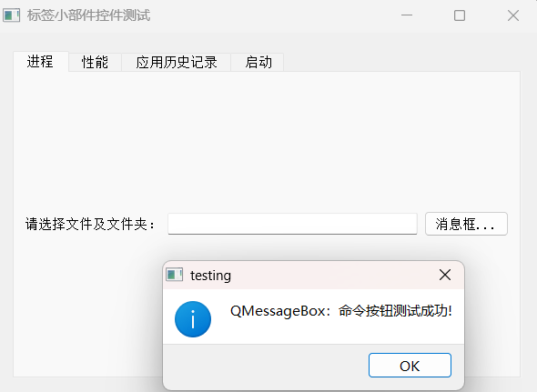

### **Frame**案例

基于 Qt Designer（ui 文件）实现的 `QFrame` 框架控件自定义样式，核心是给两个框架设置不同的背景色、边框样式和阴影效果。

**头文件：`widget.h`**

```cpp
#ifndef WIDGET_H
#define WIDGET_H

#include <QWidget>

QT_BEGIN_NAMESPACE
namespace Ui { class Widget; }
QT_END_NAMESPACE

class Widget : public QWidget
{
    Q_OBJECT

public:
    Widget(QWidget *parent = nullptr);
    ~Widget();

private:
    Ui::Widget *ui;
};
#endif // WIDGET_H
```

**代码：`widget.cpp`**

```cpp
#include "widget.h"
#include "ui_widget.h"

#include <QFrame>  // 引入QFrame类头文件，用于配置框架的形状、阴影等属性

// 构造函数：初始化窗口并配置QFrame样式
Widget::Widget(QWidget *parent)
    : QWidget(parent)
    , ui(new Ui::Widget)  // 创建UI对象（Qt Designer生成的界面类）
{
    // 1. 初始化UI界面：将ui文件中的控件与当前窗口绑定
    ui->setupUi(this);

    // 2. 设置主窗口标题
    setWindowTitle("Frame框架控件测试");

    // 3. 给两个框架设置背景色（通过样式表）
    ui->frame_1->setStyleSheet("background-color:yellow");  // frame_1背景为黄色
    ui->frame_2->setStyleSheet("background-color:green");   // frame_2背景为绿色

    // ===================== 配置frame_1的边框和阴影 =====================
    // 设置框架的边框宽度（外边框）：1像素
    ui->frame_1->setLineWidth(1);
    // 设置框架的中间线宽度：1像素（仅部分FrameShape生效，如Box）
    ui->frame_1->setMidLineWidth(1);
    // 设置框架形状：Box（矩形边框，包围整个框架）
    ui->frame_1->setFrameShape(QFrame::Box);
    // 设置框架阴影效果：Raised（凸起效果，视觉上边框向外突出）
    ui->frame_1->setFrameShadow(QFrame::Raised);

    // ===================== 配置frame_2的边框和阴影 =====================
    // 设置框架的边框宽度：0像素（外边框无宽度）
    ui->frame_2->setLineWidth(0);
    // 设置框架的中间线宽度：1像素
    ui->frame_2->setMidLineWidth(1);
    // 设置框架形状：Box（矩形边框）
    ui->frame_2->setFrameShape(QFrame::Box);
    // 设置框架阴影效果：Sunken（凹陷效果，视觉上边框向内凹陷）
    ui->frame_2->setFrameShadow(QFrame::Sunken);
}

Widget::~Widget()
{
    delete ui;
}
```

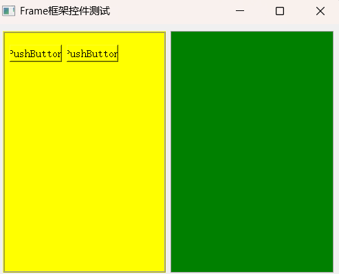


### **Dock Widget**案例

这段代码实现了在 `QMainWindow` 中创建一个可停靠窗口（`QDockWidget`），并在其中通过网格布局放置了标签、下拉框和按钮，还自定义了停靠窗口的背景色和尺寸限制。同时**`QDockWidget` 是 `QMainWindow` 的 “专属控件”** 

**头文件：`mainwindow.h`**

```cpp
#ifndef MAINWINDOW_H
#define MAINWINDOW_H

#include <QMainWindow>

QT_BEGIN_NAMESPACE
namespace Ui { class MainWindow; }
QT_END_NAMESPACE

class MainWindow : public QMainWindow
{
    Q_OBJECT

public:
    MainWindow(QWidget *parent = nullptr);
    ~MainWindow();

private:
    Ui::MainWindow *ui; //连接ui界面文件
};
#endif // MAINWINDOW_H
```

**代码：`mainwindow.cpp`**

```cpp
#include "mainwindow.h"
#include "ui_mainwindow.h"

// 引入所需控件头文件
#include <QDockWidget>   // 停靠窗口控件：可在主窗口边缘拖动/停靠
#include <QLabel>        // 标签控件：显示文本
#include <QComboBox>     // 下拉组合框：选择选项
#include <QGridLayout>   // 网格布局：排列控件
#include <QPushButton>   // 普通按钮

// 构造函数：初始化主窗口并创建停靠窗口
MainWindow::MainWindow(QWidget *parent)
    : QMainWindow(parent)
    , ui(new Ui::MainWindow)  // 创建UI对象（Qt Designer生成）
{
    // 1. 初始化UI界面：绑定ui文件中的控件到主窗口
    ui->setupUi(this);

    // 2. 创建停靠窗口对象
    // 参数1：停靠窗口标题；参数2：父对象（主窗口，自动管理内存）
    QDockWidget *dw=new QDockWidget("停靠窗口部件测试：Dock Widget",this);

    // ===================== 配置停靠窗口背景色 =====================
    // 创建调色板对象：用于设置控件的颜色属性
    QPalette pal;
    // 设置调色板的背景色为青色（Qt::cyan）
    pal.setColor(QPalette::Background,Qt::cyan);
    // 启用停靠窗口的自动填充背景（否则背景色不生效）
    dw->setAutoFillBackground(true);
    // 将调色板应用到停靠窗口
    dw->setPalette(pal);

    // ===================== 创建停靠窗口内的控件 =====================
    // 1. 标签：显示“学历层次：”
    QLabel *lab=new QLabel("学历层次：");

    // 2. 下拉组合框：添加学历选项
    QComboBox *cbx=new QComboBox();
    cbx->addItem("小学");
    cbx->addItem("初中");
    cbx->addItem("高中");
    cbx->addItem("专科");
    cbx->addItem("本科");
    cbx->addItem("硕士研究生");
    cbx->addItem("博士研究生");

        
    // 3. 两个普通按钮：显示学校名称
    QPushButton *pbt1=new QPushButton("清华大学");
    QPushButton *pbt2=new QPushButton("北京大学");

    // ===================== 配置网格布局 =====================
    // 创建网格布局对象：用于排列停靠窗口内的控件
    QGridLayout *glayout=new QGridLayout();
    // 添加控件到网格布局：addWidget(控件, 行, 列, 占用行数, 占用列数)
    glayout->addWidget(lab,0,0,1,1);    // lab → 第0行第0列，占1行1列
    glayout->addWidget(cbx,0,1,1,1);    // cbx → 第0行第1列，占1行1列
    glayout->addWidget(pbt1,1,0,1,1);   // pbt1 → 第1行第0列，占1行1列
    glayout->addWidget(pbt2,1,1,1,1);   // pbt2 → 第1行第1列，占1行1列

    // 设置布局的水平间距（控件之间的水平距离）：10像素
    glayout->setHorizontalSpacing(10);
    // 设置布局的垂直间距（控件之间的垂直距离）：10像素
    glayout->setVerticalSpacing(10);
    // 设置布局的内边距（布局边缘到控件的距离）：上下左右均为20像素
    glayout->setContentsMargins(20,20,20,20);

    // ===================== 将布局绑定到停靠窗口 =====================
    // 创建一个QWidget作为停靠窗口的核心容器（QDockWidget需绑定一个核心Widget）
    QWidget *wgt=new QWidget();
    // 将网格布局设置为核心容器的布局
    wgt->setLayout(glayout);
    // 将核心容器绑定到停靠窗口（停靠窗口显示该容器内的所有控件）->  强制性的操作
    dw->setWidget(wgt);

        
    // 4. 设置停靠窗口的最大尺寸：宽300像素，高300像素（防止拖动时过大）
    dw->setMaximumSize(300,300);
}

// 析构函数：释放UI对象内存
MainWindow::~MainWindow()
{
    delete ui;
}
```

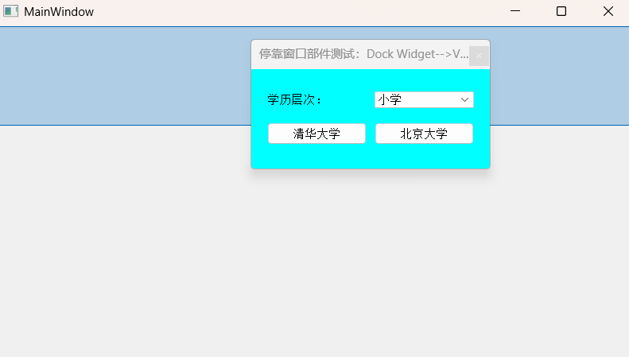


## 三、控件组合使用场景示例

### 场景 1：表单分组与选择

- 用 `Group Box` 将 “登录方式选择” 分组，内部放置两个 `Radio Button`（密码登录 / 验证码登录）；
- 用 `Check Box` 添加 “记住密码”“自动登录” 选项；
- 底部用 `Dialog Button Box` 放置 “登录”“取消” 按钮，实现标准化表单界面。

### 场景 2：多页面切换与辅助功能

- 主内容区域用 `Tab Widget` 分为 “基本信息”“高级设置”“历史记录” 三个标签页；
- 右侧用 `Dock Widget` 放置 “快捷操作” 工具组（包含多个 `Tool Button`）；
- “历史记录” 标签页内部用 `Scroll Area` 承载长列表内容，支持滚动查看。

### 场景 3：多文档编辑界面

- 主窗口中心用 `MDI Area` 作为多文档容器，支持打开多个子文档窗口；
- 顶部工具栏用 `Tool Button` 放置 “新建”“打开”“保存” 等工具；
- 左侧用 `Tool Box` 放置 “格式设置”“插件列表” 等工具面板。