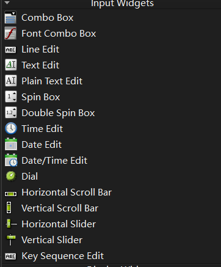
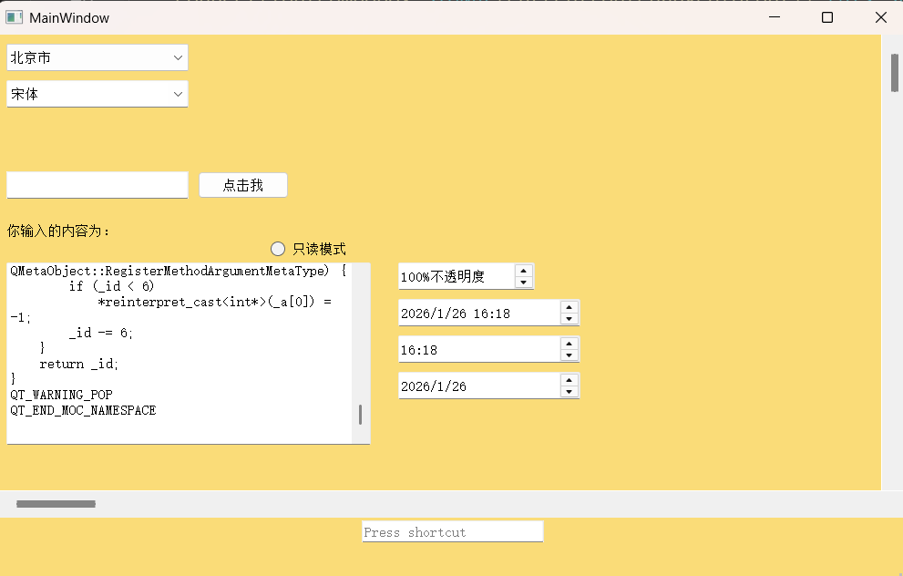
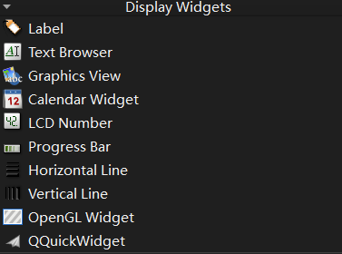
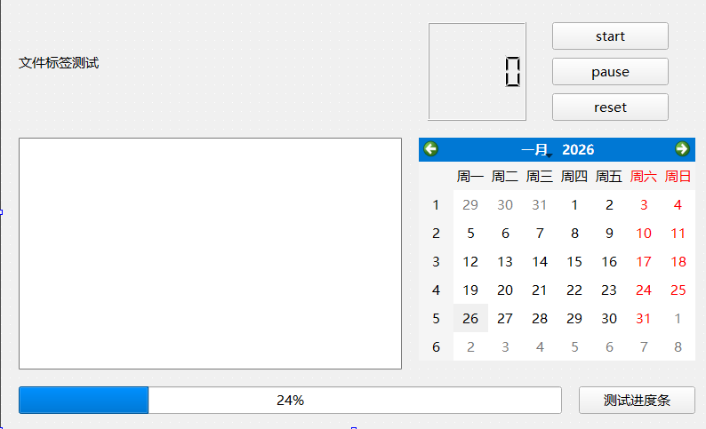
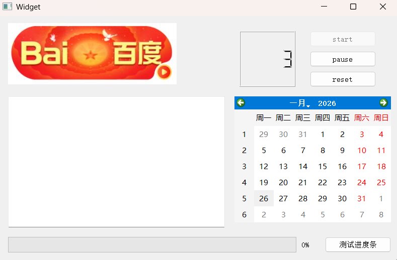

## Qt 开发常用控件总结：Input Widgets 与 Display Widgets

## 一、输入组控件（Input Widgets）



|     控件英文名称      |  控件中文名称  |                         核心功能描述                         |
| :-------------------: | :------------: | :----------------------------------------------------------: |
|       Combo Box       |   编辑组合框   |      下拉式组合输入控件，支持选择预设选项或手动输入内容      |
|    Font Combo Box     |   字体组合框   |      专门用于选择字体的下拉组合框，预设系统可用字体列表      |
|       Line Edit       |    行编辑框    | 单行文本输入控件，适用于短文本输入（如账号、密码、搜索关键词等） |
|       Text Edit       |   文本编辑框   | 支持格式化的文本编辑控件，可处理多行文本，支持字体、颜色等格式设置 |
|    Plain Text Edit    | 多行文本编辑器 | 纯文本多行输入控件，专注于文本内容输入，不支持格式化，适合大量纯文本编辑（如日志、备注等） |
|       Spin Box        |   整数旋转框   | 整数数值输入控件，支持通过上下箭头调整数值或直接输入，限定整数类型 |
|    Double Spin Box    |   小数旋转框   |  小数数值输入控件，支持小数类型数值的调整与输入，可设置精度  |
|       Time Edit       |    时间编辑    |  时间输入控件，提供标准化时间格式（时、分、秒）的输入与选择  |
|       Date Edit       |    日期编辑    |  日期输入控件，支持标准化日期格式（年、月、日）的输入与选择  |
|    Date/Time Edit     |  日期时间编辑  |      日期 + 时间组合输入控件，整合日期和时间的输入功能       |
|         Dial          |    表盘控件    |    圆形旋钮式输入控件，通过旋转操作设置数值，类似物理表盘    |
| Horizontal Scroll Bar |   水平滚动条   | 用于界面水平方向滚动控制的输入控件，支持手动拖拽或点击箭头实现滚动 |
|  Vertical Scroll Bar  |   垂直滚动条   | 用于界面垂直方向滚动控制的输入控件，支持手动拖拽或点击箭头实现滚动 |
|   Horizontal Slider   |   水平滑动条   | 水平方向滑块式输入控件，通过拖拽滑块设置数值（如音量、亮度调节等） |
|    Vertical Slider    |   垂直滑动条   | 垂直方向滑块式输入控件，通过拖拽滑块设置数值（如音量、亮度调节等） |
|   Key Sequence Edit   | 快捷键输入控件 | 专门用于设置快捷键的输入控件，支持用户按下组合键直接录入快捷键 |

### 案例代码

核心功能是**集中展示 Qt Input Widgets 类控件的使用方法**，包括下拉框、字体选择框、输入框、旋转框、日期时间编辑框、滚动条、快捷键输入框等，并通过信号槽机制实现各控件的交互逻辑，同时自定义了窗口样式和透明度调节功能

#### **头文件`mainwindow.h`**

```cpp
#ifndef MAINWINDOW_H
#define MAINWINDOW_H

#include <QMainWindow>


// 1:Combo Box控件
#include <QComboBox>


// 2:FontComboBox控件
#include <QFontComboBox>
#include <QLabel>

// 3:Line Edit控件
#include <QLineEdit>
#include <QPushButton>

// 4:Plain Text Edit控件
#include <QPlainTextEdit>
#include <QRadioButton>

// 5:Spin Box控件
#include <QSpinBox>

// 6:时间控件
#include <QTimeEdit>
#include <QDateEdit>
#include <QDateTimeEdit>


// 7: Scroll Bar控件
#include <QScrollBar>

// 8: Key Sequence Edit控件
#include <QKeySequenceEdit>

QT_BEGIN_NAMESPACE
namespace Ui { class MainWindow; }
QT_END_NAMESPACE

class MainWindow : public QMainWindow
{
    Q_OBJECT

public:
    MainWindow(QWidget *parent = nullptr);
    ~MainWindow();

private:
    Ui::MainWindow *ui;


    // 1:声明一个QComboBox对象
private:
    QComboBox *combobox;
private slots:
    void comboboxIndex(int);

    // 2:声明QFontComboBox/QLabel对象
private:
    QFontComboBox *fontcombobox;
    QLabel *qlabels;
private slots:
    void fontcomboboxFunc(QFont);

    // 3:声明QLineEdit/QPushButton/QLabel对象
private:
    QLineEdit *lineedit;
    QPushButton *pushbutton;
    QLabel *qlabely;
private slots:
    void pushbuttonclicked();

    // 4:声明QPlainTextEdit/QRadioButton对象
private:
    QPlainTextEdit *plaintedit;
    QRadioButton *radiobutton;
private slots:
    void radioButtonClicked();

    // 5:声明QPlainTextEdit/QRadioButton对象
private:
    QSpinBox *spinbox;
private slots:
    void spinboxValueChanged(int);

    // 6:声明QDateTimeEdit/QTimeEdit/QDateEdit对象
private:
    QDateTimeEdit *dte;
    QTimeEdit *te;
    QDateEdit *de;

    // 7:声明QScrollBar对象
private:
    QScrollBar *hscrollbar,*vscrollbar;


    // 8:声明QKeySequenceEdit对象
private:
    QKeySequenceEdit *kse;
private slots:
    void keyseqeditChanged(const QKeySequence &);

};
#endif // MAINWINDOW_H
```

#### **代码`mainwindow.cpp`**

```cpp
#include "mainwindow.h"
#include "ui_mainwindow.h"

#include <QMessageBox>
#include <QDebug>
#include <QDir>
#include <QTextStream>
#include <QCoreApplication>

MainWindow::MainWindow(QWidget *parent)
    : QMainWindow(parent)
    , ui(new Ui::MainWindow)
{
    ui->setupUi(this);


    // 设置主空格的显示位置及大小
    this->setGeometry(300,200,1000,600);

    // 1:
    combobox=new QComboBox(this); // 实例化对象
    combobox->setGeometry(10,10,200,30);
    combobox->addItem("北京市");
    combobox->addItem("上海市");
    combobox->addItem("天津市");
    combobox->addItem("重庆市");
    combobox->addItem("湖南省");
    combobox->addItem("江西省");
    combobox->addItem("广东省");
    combobox->addItem("香港特别行政区");
    combobox->addItem("澳门特别行政区");

    // 信号槽函数连接实现
    connect(combobox,SIGNAL(currentIndexChanged(int)),this,SLOT(comboboxIndex(int)));

    // 2:
    fontcombobox=new QFontComboBox(this);
    qlabels=new QLabel(this);
    fontcombobox->setGeometry(10,50,200,30);
    qlabels->setGeometry(10,70,300,50);

    // 信号与槽函数连接
    connect(fontcombobox,SIGNAL(currentFontChanged(QFont)),this,SLOT(fontcomboboxFunc(QFont)));

    // 3:
    lineedit=new QLineEdit(this);
    lineedit->setGeometry(10,150,200,30);
    pushbutton=new QPushButton(this);
    pushbutton->setGeometry(220,150,100,30);
    pushbutton->setText("点击我");
    qlabely=new QLabel(this);
    qlabely->setGeometry(10,200,400,30);
    qlabely->setText("你输入的内容为：");

    // 信号与槽函数连接
    connect(pushbutton,SIGNAL(clicked()),this,SLOT(pushbuttonclicked()));

    // 4:
    plaintedit=new QPlainTextEdit(this);
    plaintedit->setGeometry(10,250,400,200);
    radiobutton=new QRadioButton(this);
    radiobutton->setGeometry(300,220,200,30);
    radiobutton->setText("只读模式");

    // 设置工作目录为可执行程序的工作目录
    QDir::setCurrent(QCoreApplication::applicationDirPath());
    QFile fe("moc_mainwindow.cpp");
    fe.open((QFile::ReadOnly|QFile::Text));

    // 加载到文件流
    QTextStream strin(&fe);
    plaintedit->insertPlainText(strin.readAll());

    // 信号与槽函数连接
    connect(radiobutton,SIGNAL(clicked()),this,SLOT(radioButtonClicked()));


    // 5: 改变窗口背景颜色
    this->setStyleSheet("QMainWindow{background-color:""rgba(250,220,120,100%)}");

    spinbox=new QSpinBox(this);
    spinbox->setGeometry(440,250,150,30);

    spinbox->setRange(0,100);
    spinbox->setSingleStep(10);
    spinbox->setValue(100);

    spinbox->setSuffix("%不透明度");

    // 信号与槽函数连接
    connect(spinbox,SIGNAL(valueChanged(int)),this,SLOT(spinboxValueChanged(int)));


    // 6:*dte/te/de
    dte=new QDateTimeEdit(QDateTime::currentDateTime(),this);
    dte->setGeometry(440,290,200,30);
    te=new QTimeEdit(QTime::currentTime(),this);
    te->setGeometry(440,330,200,30);
    de=new QDateEdit(QDate::currentDate(),this);
    de->setGeometry(440,370,200,30);


    // 7:
    hscrollbar=new QScrollBar(Qt::Horizontal,this);
    hscrollbar->setGeometry(0,500,1000,30);
    vscrollbar=new QScrollBar(Qt::Vertical,this);
    vscrollbar->setGeometry(970,0,30,500);

    // 8：
    kse=new QKeySequenceEdit(this);
    kse->setGeometry(400,530,200,30);
    // 信号与槽函数连接
    connect(kse,SIGNAL(keySequenceChanged(const QKeySequence &)),
             this,SLOT(keyseqeditChanged(const QKeySequence &)));

}

MainWindow::~MainWindow()
{
    delete ui;
}


// 1:
void MainWindow::comboboxIndex(int index)
{
    qDebug()<<"你选择的区别是："<<combobox->itemText(index)<<endl;

    QMessageBox mybox(QMessageBox::Question,"信息",combobox->itemText(index),QMessageBox::Yes|QMessageBox::No);
    mybox.exec();
}

// 2:
void MainWindow::fontcomboboxFunc(QFont font)
{
    qlabels->setFont(font);
    QString qStr="QT开发工程师";
    qlabels->setText(qStr);
}

// 3:
void MainWindow::pushbuttonclicked()
{
    QString qStr;
    qStr="你输入的内容为：";
    qStr=qStr+lineedit->text();

    qlabely->setText(qStr);
    lineedit->clear();
}

// 4:
void MainWindow::radioButtonClicked()
{
    if(radiobutton->isChecked()){
        plaintedit->setReadOnly(true);
    }
    else
        plaintedit->setReadOnly(false);
}

// 5:
void MainWindow::spinboxValueChanged(int x)
{
    double dx=(double)x/100;

    this->setWindowOpacity(dx);
}

// 8：
void MainWindow::keyseqeditChanged(const QKeySequence &key)
{
    if(key==QKeySequence(tr("Ctrl+Q")))
        this->close();
    else
        qDebug()<<key.toString()<<endl;

}
```




#### 解释：

**构造函数部分（MainWindow::MainWindow）**

基础窗口设置

```cpp
// 设置主窗口的显示位置及大小（x坐标:300, y坐标:200, 宽度:1000, 高度:600）
this->setGeometry(300,200,1000,600);
```

- `setGeometry()`：Qt 控件通用方法，用于设置控件（此处为主窗口）的位置和尺寸，参数顺序为 `x, y, width, height`。

##### 1: 下拉组合框（QComboBox）

```cpp
combobox=new QComboBox(this); // 实例化下拉框对象，指定父对象为当前窗口
combobox->setGeometry(10,10,200,30); // 设置下拉框位置（x:10,y:10）和尺寸（宽200,高30）
// 向下拉框添加选项（省份/直辖市）
combobox->addItem("北京市");
combobox->addItem("上海市");
// ...
// 信号槽连接：当下拉框选中项索引变化时，触发 comboboxIndex 槽函数
connect(combobox,SIGNAL(currentIndexChanged(int)),this,SLOT(comboboxIndex(int)));
```

- `QComboBox`：输入类控件，用于提供下拉选项列表；
- `addItem()`：向下拉框添加文本选项；
- 信号 `currentIndexChanged(int)`：选中项变化时触发，参数为新选中项的索引；

```cpp
void MainWindow::comboboxIndex(int index)
{
    // 打印选中项的文本（index 为选中项索引）
    qDebug()<<"你选择的区别是："<<combobox->itemText(index)<<endl;

    // 实例化消息框：类型为 Question（问号），标题“信息”，内容为选中项文本，按钮为 Yes/No
    QMessageBox mybox(QMessageBox::Question,"信息",combobox->itemText(index),QMessageBox::Yes|QMessageBox::No);
    mybox.exec(); // 显示消息框（阻塞式，直到用户点击按钮）
}
```


##### 2: 字体选择组合框（QFontComboBox）+ 标签（QLabel）

```cpp
fontcombobox = new QFontComboBox(this); // 实例化字体选择下拉框（默认包含系统所有字体）
qlabels = new QLabel(this); // 实例化标签控件，用于展示字体效果
fontcombobox->setGeometry(10,50,200,30); // 设置字体下拉框位置
qlabels->setGeometry(10,70,300,50); // 设置标签位置和尺寸
// 信号槽连接：当选中字体变化时，触发 fontcomboboxFunc 槽函数（参数为选中的字体）
connect(fontcombobox,SIGNAL(currentFontChanged(QFont)),this,SLOT(fontcomboboxFunc(QFont)));
```

- `QFontComboBox`：专门用于选择字体的下拉框，无需手动添加字体列表；
- 信号 `currentFontChanged(QFont)`：选中字体变化时触发，参数为选中的 `QFont` 对象；
- `QLabel`：显示类控件，此处用于实时展示选中字体的效果。

```cpp
void MainWindow::fontcomboboxFunc(QFont font)
{
    qlabels->setFont(font); // 设置标签的字体为选中的字体
    QString qStr="QT开发工程师"; 
    qlabels->setText(qStr); // 设置标签显示的文本，展示字体效果
}
```


##### 3: 单行输入框（QLineEdit）+ 按钮（QPushButton）+ 标签（QLabel）

```cpp
lineedit=new QLineEdit(this); // 实例化单行输入框
lineedit->setGeometry(10,150,200,30); // 设置输入框位置
pushbutton=new QPushButton(this); // 实例化按钮
pushbutton->setGeometry(220,150,100,30); // 设置按钮位置
pushbutton->setText("点击我"); // 设置按钮显示文本
qlabely=new QLabel(this); // 实例化标签（用于展示输入内容）
qlabely->setGeometry(10,200,400,30); // 设置标签位置
qlabely->setText("你输入的内容为："); // 设置标签默认文本
// 信号槽连接：按钮被点击时，触发 pushbuttonclicked 槽函数
connect(pushbutton,SIGNAL(clicked()),this,SLOT(pushbuttonclicked()));
```

- `QLineEdit`：单行文本输入控件，用于接收用户短文本输入；
- `QPushButton`：按钮控件，点击触发交互逻辑；

```cpp
void MainWindow::pushbuttonclicked()
{
    QString qStr;
    qStr="你输入的内容为：";
    qStr=qStr+lineedit->text(); // 拼接默认文本和输入框内容

    qlabely->setText(qStr); // 更新标签文本，展示输入内容
    lineedit->clear(); // 清空输入框
}
```


##### 4: 纯文本编辑框（QPlainTextEdit）+ 单选按钮（QRadioButton）

```cpp
plaintedit=new QPlainTextEdit(this); // 实例化纯文本编辑框
plaintedit->setGeometry(10,250,400,200); // 设置编辑框位置和尺寸
radiobutton=new QRadioButton(this); // 实例化单选按钮
radiobutton->setGeometry(300,220,200,30); // 设置单选按钮位置
radiobutton->setText("只读模式"); // 设置单选按钮文本

// 设置工作目录为可执行程序所在目录（避免文件路径错误）
QDir::setCurrent(QCoreApplication::applicationDirPath());
QFile fe("moc_mainwindow.cpp"); // 实例化文件对象，指定要读取的文件
fe.open((QFile::ReadOnly|QFile::Text)); // 以“只读+文本模式”打开文件

// 加载文件内容到文本流
QTextStream strin(&fe);
plaintedit->insertPlainText(strin.readAll()); // 将文件内容插入到纯文本编辑框

// 信号槽连接：单选按钮被点击时，触发 radioButtonClicked 槽函数
connect(radiobutton,SIGNAL(clicked()),this,SLOT(radioButtonClicked()));
```

- `QPlainTextEdit`：多行纯文本编辑控件，适合展示 / 编辑大量纯文本；
- `QRadioButton`：单选按钮，用于切换状态（此处为 “只读 / 可编辑”）；
- `QFile`：文件操作类，`open()` 方法指定打开模式（`ReadOnly` 只读，`Text` 文本模式）；
- `QTextStream`：按文本格式读取文件内容，`readAll()` 读取全部内容。

```cpp
void MainWindow::radioButtonClicked()
{
    if(radiobutton->isChecked()){ // 判断单选按钮是否被选中
        plaintedit->setReadOnly(true); // 选中：设置文本编辑框为只读
    }
    else
        plaintedit->setReadOnly(false); // 未选中：取消只读，可编辑
}
```


##### 5: 窗口样式 + 旋转框（QSpinBox）

```cpp
// 设置主窗口背景色：rgba(250,220,120,100%) 浅橙黄色，透明度100%
this->setStyleSheet("QMainWindow{background-color:""rgba(250,220,120,100%)}");

spinbox=new QSpinBox(this); // 实例化整数旋转框
spinbox->setGeometry(440,250,150,30); // 设置旋转框位置

spinbox->setRange(0,100); // 设置数值范围：0~100
spinbox->setSingleStep(10); // 设置步长：每次增减10
spinbox->setValue(100); // 设置初始值：100

spinbox->setSuffix("%不透明度"); // 设置数值后缀文本

// 信号槽连接：旋转框数值变化时，触发 spinboxValueChanged 槽函数
connect(spinbox,SIGNAL(valueChanged(int)),this,SLOT(spinboxValueChanged(int)));
```

- `setStyleSheet()`：Qt 样式表，类似 CSS，用于自定义控件外观；
- `QSpinBox`：整数数值输入控件，支持上下箭头调整或手动输入；
- `setRange()`/`setSingleStep()`/`setValue()`：设置数值范围、步长、初始值；
- `setSuffix()`：为数值添加后缀文本，提升用户可读性。

```cpp
void MainWindow::spinboxValueChanged(int x)
{
    double dx=(double)x/100; // 将整数（0~100）转换为小数（0.0~1.0）

    this->setWindowOpacity(dx); // 设置窗口透明度（0.0 完全透明，1.0 完全不透明）
}
```


##### 6: 日期时间编辑框（QDateTimeEdit/QTimeEdit/QDateEdit）

```cpp
// 实例化日期时间编辑框，初始值为当前系统日期时间，指定父对象
dte=new QDateTimeEdit(QDateTime::currentDateTime(),this);
dte->setGeometry(440,290,200,30); // 设置位置
te=new QTimeEdit(QTime::currentTime(),this); // 时间编辑框，初始值为当前系统时间
te->setGeometry(440,330,200,30);
de=new QDateEdit(QDate::currentDate(),this); // 日期编辑框，初始值为当前系统日期
de->setGeometry(440,370,200,30);
```

- `QDateTimeEdit`/`QTimeEdit`/`QDateEdit`：分别用于编辑 “日期 + 时间”、“时间”、“日期”；
- `currentDateTime()`/`currentTime()`/`currentDate()`：获取系统当前的日期 / 时间。


##### 7: 滚动条（QScrollBar）

```cpp
// 实例化水平滚动条，指定方向为 Horizontal，父对象为当前窗口
hscrollbar=new QScrollBar(Qt::Horizontal,this);
hscrollbar->setGeometry(0,500,1000,30); // 设置水平滚动条位置（窗口底部）
// 实例化垂直滚动条，指定方向为 Vertical
vscrollbar=new QScrollBar(Qt::Vertical,this);
vscrollbar->setGeometry(970,0,30,500); // 设置垂直滚动条位置（窗口右侧）
```

- `QScrollBar`：滚动条控件，分为水平 / 垂直两种方向；


##### 8: 快捷键输入框（QKeySequenceEdit）

```cpp
kse=new QKeySequenceEdit(this); // 实例化快捷键输入框
kse->setGeometry(400,530,200,30); // 设置位置
// 信号槽连接：快捷键输入变化时，触发 keyseqeditChanged 槽函数
connect(kse,SIGNAL(keySequenceChanged(const QKeySequence &)),
         this,SLOT(keyseqeditChanged(const QKeySequence &)));
```

- `QKeySequenceEdit`：专门用于输入 / 编辑快捷键的控件，支持识别组合键（如 Ctrl+Q）；
- 信号 `keySequenceChanged(const QKeySequence &)`：输入的快捷键变化时触发，参数为选中的快捷键对象。

```cpp
void MainWindow::keyseqeditChanged(const QKeySequence &key)
{
    if(key==QKeySequence(tr("Ctrl+Q"))) // 判断输入的快捷键是否为 Ctrl+Q
        this->close(); // 是：关闭窗口
    else
        qDebug()<<key.toString()<<endl; // 否：打印快捷键文本（如 “Ctrl+A”）
}
```

------


## 二、显示组控件（Display Widgets）



|  控件英文名称   |    控件中文名称     |                         核心功能描述                         |
| :-------------: | :-----------------: | :----------------------------------------------------------: |
|      Label      |        标签         | 基础文本 / 图片展示控件，用于显示静态文本（如提示信息）或图片，不可编辑 |
|  Text Browser   |     文本浏览器      | 文本展示控件，支持浏览多行文本、超链接跳转，适合展示大量静态文本（如帮助文档、日志内容等） |
|  Graphics View  |    图形视图框架     | 高级图形展示与交互框架，支持大规模图形元素的渲染、缩放、旋转及交互操作，适用于复杂图形场景 |
| Calendar Widget |      日历控件       | 可视化日历展示控件，支持日期选择、月份切换，直观呈现日期信息 |
|   LCD Number    |  液晶字体数字控件   | 以液晶屏幕风格展示数字的控件，适合需要特殊数字显示效果的场景（如计数器、计时器等） |
|  Progress Bar   |       进度条        | 进度展示控件，用于显示任务完成进度（如文件下载、数据处理等），支持百分比或自定义范围展示 |
| Horizontal Line |       水平线        | 界面分隔控件，用于分割水平方向的界面区域，提升界面布局层次感 |
|  Vertical Line  |       垂直线        | 界面分隔控件，用于分割垂直方向的界面区域，提升界面布局层次感 |
|  OpenGL Widget  | OpenGL 图形渲染控件 | 支持 OpenGL 渲染的控件，用于高性能 3D 图形、复杂动画的展示与渲染 |
|  QQuickWidget   |    QML 嵌入控件     | 用于嵌入 QML 界面的控件，支持在 Qt Widgets 项目中集成 QML 开发的界面组件，实现跨技术栈界面展示 |

提前在UI文件布局一下：



### 案例代码

核心展示 **Display Widgets 类控件的使用** + 进度条、定时器等交互逻辑，包括：加载图片到标签、读取文本文件到文本浏览器、进度条更新、定时器计数（LCD 显示），这是 Qt 基础控件和信号槽机制的典型入门示例。

#### 头文件`widget.h`

```cpp
#ifndef WIDGET_H
#define WIDGET_H

#include <QWidget>

// 1:
#include <QMessageBox>

// 2:
#include <QFile>

// 4:
#include <QTimer>


QT_BEGIN_NAMESPACE
namespace Ui { class Widget; }
QT_END_NAMESPACE

class Widget : public QWidget
{
    Q_OBJECT

public:
    Widget(QWidget *parent = nullptr);
    ~Widget();

private slots:
    void on_pushButtonProgressBar_clicked();

    void on_pushbtnstart_clicked();

    void on_pushbtnpause_clicked();

    void on_pushbtnreset_clicked();

    // 4:
    // 自定义函数：定时器
    void on_timerout();
private:
    int iValues=0;
    QTimer *timers; // 定时器
    void InitFunc();

private:
    Ui::Widget *ui;

    // 1:
private:
    void textlabelFunc();

    // 2:
private:
    void textbrowserFuncReadTxt();

};
#endif // WIDGET_H
```

#### 代码`widget.cpp`

```cpp
#include "widget.h"
#include "ui_widget.h"

Widget::Widget(QWidget *parent)
    : QWidget(parent)
    , ui(new Ui::Widget)
{
    ui->setupUi(this);

    // 1:调用函数
    textlabelFunc();

    // 2:调用函数
    textbrowserFuncReadTxt();


    // 3:初始化进程条
    ui->progressBar->setRange(0,1000000);
    ui->progressBar->setValue(0);

    // 4:
    InitFunc();
    // 信号与槽函数连接
    connect(timers,&QTimer::timeout,this,&Widget::on_timerout);

}

Widget::~Widget()
{
    delete ui;
}

// 1:
void Widget::textlabelFunc()
{
    QString fName("D:/Desk/Input Widgets&Display Widgets)/666.jpg");

    QImage *qimg=new QImage;

    if(!(qimg->load(fName))) // 判断加载图片
    {
        QMessageBox::information(this,"失败","加载jpg图片失败，请重新检查?");
        delete  qimg;

        return;
    }

    ui->labeljpg->setPixmap(QPixmap::fromImage(*qimg));
}

// 2:
void Widget::textbrowserFuncReadTxt()
{
    QString qStrdData;
    QFile qfile("d:\\testfile.txt");

    if(!(qfile.open(QIODevice::ReadOnly|QIODevice::Text)))
    {
        QMessageBox::warning(this,"失败","打开文件失败，请重新检查?");
    }

    while (!qfile.atEnd())
    {
        QByteArray ay=qfile.readLine();
        QString strs(ay);
        qStrdData.append(strs);
    }

    ui->textBrowser->setText(qStrdData);
}

void Widget::on_pushButtonProgressBar_clicked()
{
    for(int i=1;i<=1000000;i++)
    {
        for(int j=0;j<1;j++)
        {
            ui->progressBar->setValue(i);
        }
    }
}

void Widget::on_pushbtnstart_clicked()
{
    timers->start(); // 1s触发一次操作
    ui->pushbtnstart->setEnabled(false);
    ui->pushbtnpause->setEnabled(true);
    ui->pushbtnreset->setEnabled(true);

}

void Widget::on_pushbtnpause_clicked()
{
    timers->stop(); // 1s触发一次操作
    ui->pushbtnstart->setEnabled(true);
    ui->pushbtnpause->setEnabled(false);
    ui->pushbtnreset->setEnabled(true);

}

void Widget::on_pushbtnreset_clicked()
{
    timers->stop(); // 1s触发一次操作
    iValues=0;

    ui->lcdNumber->display(iValues);

    ui->pushbtnstart->setEnabled(true);
    ui->pushbtnpause->setEnabled(true);
    ui->pushbtnreset->setEnabled(false);

}

void Widget::InitFunc()
{
    timers=new QTimer(this);
    timers->setInterval(1000); // 定时周期为1s
    timers->stop();

}

void Widget::on_timerout()
{
    iValues++;
    ui->lcdNumber->display(iValues);
}
```



#### 解释

##### **构造函数部分**

```cpp
Widget::Widget(QWidget *parent)
    : QWidget(parent)  // 继承父类构造函数，指定父窗口（用于内存管理）
    , ui(new Ui::Widget) // 实例化 UI 界面对象（关联 .ui 文件中的控件）
{
    ui->setupUi(this); // 初始化 UI 界面，将 .ui 文件中的控件加载到当前窗口

    // 1:调用函数 —— 加载图片到 Label 控件
    textlabelFunc();

    // 2:调用函数 —— 读取 TXT 文件内容到 TextBrowser 控件
    textbrowserFuncReadTxt();

    // 3:初始化进度条
    ui->progressBar->setRange(0,1000000); // 设置进度条数值范围：最小值0，最大值1000000
    ui->progressBar->setValue(0); // 设置进度条初始值为0（无进度）

    // 4:初始化定时器相关
    InitFunc(); // 调用定时器初始化函数
    // 信号槽连接：定时器超时（1秒到）时，触发 on_timerout 槽函数
    connect(timers,&QTimer::timeout,this,&Widget::on_timerout);
}
```

- `ui->setupUi(this)`：必须执行的核心函数，将 UI 设计器中拖放的控件（如 labeljpg、progressBar）实例化，否则无法访问 `ui->xxx` 控件；
- 按编号调用功能函数，实现 “窗口启动即加载图片 / 文本” 的效果；
- 进度条初始化：先设置范围，再设初始值，是 `QProgressBar` 的标准使用流程；
- 定时器信号槽：使用 Qt 新语法（`&类::函数`），比旧语法（SIGNAL/SLOT）更安全，`timeout` 信号在定时器周期到后触发。

 **核心功能函数解析**

##### 1: textlabelFunc（加载图片到 QLabel）

```cpp
void Widget::textlabelFunc()
{
    // 定义图片路径（推荐用 / 作为分隔符，跨平台兼容）
    QString fName("D:/Desk/Input Widgets&Display Widgets)/666.jpg");

    // 动态创建 QImage 对象（堆内存），用于加载图片
    QImage *qimg=new QImage;

    if(!(qimg->load(fName))) // 判断图片是否加载成功（失败返回false）
    {
        // 加载失败：弹出提示框，标题“失败”，内容提示检查路径
        QMessageBox::information(this,"失败","加载jpg图片失败，请重新检查?");
        delete  qimg; // 释放图片对象，避免内存泄漏
        return; // 函数提前退出，不执行后续设置图片的逻辑
    }

    // 加载成功：将 QImage 转换为 QPixmap，设置到 Label 控件显示
    ui->labeljpg->setPixmap(QPixmap::fromImage(*qimg));
    // 注：此处可补充 delete qimg; 否则图片对象会一直占用内存（直到程序退出）
}
```

- `QImage` vs `QPixmap`：`QImage` 侧重图片加载 / 处理，`QPixmap` 侧重图片显示，Qt 标签控件需用 `QPixmap` 显示图片；
- 关键逻辑：加载失败时必须 `delete qimg`，否则会造成内存泄漏；加载成功后也建议释放（因为图片已转换为 `QPixmap` 存入 Label）。

##### 2: textbrowserFuncReadTxt（读取 TXT 文件到 QTextBrowser）

```cpp
void Widget::textbrowserFuncReadTxt()
{
    QString qStrdData; // 存储读取的文件内容（拼接所有行）
    // 定义要读取的文件路径（Windows 原生分隔符 \，需转义为 \\）
    QFile qfile("d:\\testfile.txt");

    // 打开文件：只读模式（ReadOnly）+ 文本模式（Text），失败则弹出警告
    if(!(qfile.open(QIODevice::ReadOnly|QIODevice::Text)))
    {
        QMessageBox::warning(this,"失败","打开文件失败，请重新检查?");
    }

    // 循环读取文件：直到文件末尾（atEnd() 返回true）
    while (!qfile.atEnd())
    {
        QByteArray ay=qfile.readLine(); // 逐行读取文件内容（返回字节数组）
        QString strs(ay); // 将字节数组转换为 QString（方便拼接）
        qStrdData.append(strs); // 拼接每行内容到总字符串
    }

    // 将拼接后的完整内容设置到 TextBrowser 控件显示
    ui->textBrowser->setText(qStrdData);
}
```

- ```cpp
  QFile::open()
  ```

   模式：

  - `ReadOnly`：仅读取文件，无法写入；
  - `Text`：文本模式，自动处理换行符（Windows \r\n → Qt \n）；

- 逐行读取：避免一次性读取大文件导致内存占用过高；

- 潜在优化：文件打开失败后，`qfile` 未关闭，但 Qt 析构时会自动关闭，不影响功能。

**槽函数**

##### on_pushButtonProgressBar_clicked（进度条按钮点击槽函数）

```cpp
void Widget::on_pushButtonProgressBar_clicked()
{
    // 外层循环：遍历进度条最大值（0~1000000）
    for(int i=1;i<=1000000;i++)
    {
        // 内层
        for(int j=0;j<1;j++)
        {
            // 更新进度条数值为当前 i（逐次增加）
            ui->progressBar->setValue(i);
        }
    }
}
```

- 核心逻辑：点击按钮后，循环将进度条数值从 1 设到 1000000，实现 “进度条填满” 效果；

##### on_pushbtnstart_clicked（定时器开始按钮槽函数）

```cpp
void Widget::on_pushbtnstart_clicked()
{
    timers->start(); // 启动定时器（1秒触发一次 timeout 信号）
    // 按钮状态控制：禁用“开始”按钮，避免重复点击
    ui->pushbtnstart->setEnabled(false);
    // 启用“暂停”“重置”按钮，允许后续操作
    ui->pushbtnpause->setEnabled(true);
    ui->pushbtnreset->setEnabled(true);
}
```

- `timers->start()`：启动定时器，按 `InitFunc` 中设置的 1000ms（1 秒）周期触发 `timeout` 信号；
- 按钮状态控制：通过 `setEnabled(bool)` 禁用 / 启用按钮，是界面交互的常用逻辑（避免无效操作）。

##### on_pushbtnpause_clicked（定时器暂停按钮槽函数）

```cpp
void Widget::on_pushbtnpause_clicked()
{
    timers->stop(); // 停止定时器（不再触发 timeout 信号）
    // 按钮状态控制：启用“开始”按钮，允许继续计数
    ui->pushbtnstart->setEnabled(true);
    // 禁用“暂停”按钮，避免重复点击
    ui->pushbtnpause->setEnabled(false);
    // 保留“重置”按钮可用
    ui->pushbtnreset->setEnabled(true);
}
```

- `timers->stop()`：暂停定时器，计数停止，但 `iValues`（计数值）不会重置；
- 按钮状态逻辑与 “开始” 按钮互补，保证界面操作的唯一性。

##### on_pushbtnreset_clicked（定时器重置按钮槽函数）

```cpp
void Widget::on_pushbtnreset_clicked()
{
    timers->stop(); // 先停止定时器
    iValues=0; // 重置计数值为0

    ui->lcdNumber->display(iValues); // 更新 LCD 控件显示数值为0

    // 按钮状态恢复初始：启用“开始”“暂停”，禁用“重置”
    ui->pushbtnstart->setEnabled(true);
    ui->pushbtnpause->setEnabled(true);
    ui->pushbtnreset->setEnabled(false);
}
```

- 核心逻辑：停止计数 → 重置数值 → 更新显示 → 恢复按钮初始状态；
- `iValues`：需在 `widget.h` 中声明为类成员变量（`int iValues = 0;`），否则无法跨函数访问。

##### InitFunc（定时器初始化函数）

```cpp
void Widget::InitFunc()
{
    timers=new QTimer(this); // 实例化定时器对象，指定父对象为当前窗口（自动管理内存）
    timers->setInterval(1000); // 设置定时器周期：1000毫秒（1秒）
    timers->stop(); // 初始状态为停止（避免窗口启动就开始计数）
}
```

- `setInterval(1000)`：设置定时器触发间隔，单位为毫秒；
- 初始 `stop()`：保证定时器默认不运行，需点击 “开始” 按钮才启动。

##### on_timerout（定时器超时槽函数）

```cpp
void Widget::on_timerout()
{
    iValues++; // 计数值自增1
    ui->lcdNumber->display(iValues); // 将最新数值显示到 LCDNumber 控件
}
```

- 定时器核心逻辑：每 1 秒执行一次，计数值 + 1 并更新显示；
- `QLCDNumber::display()`：专门用于显示数字的方法，支持 int/double 等类型，比 `setText()` 更适配数字显示场景。