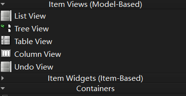
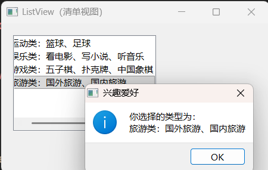
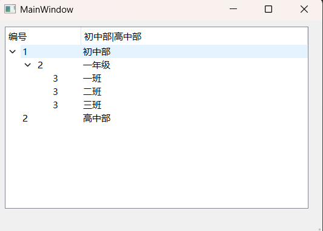
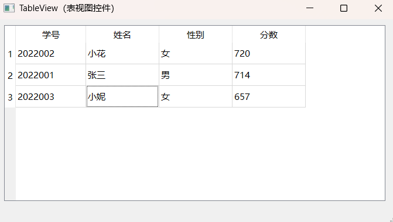
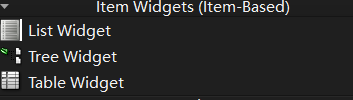
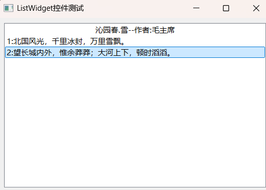
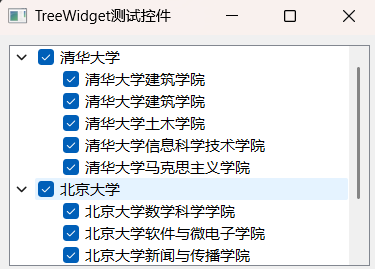
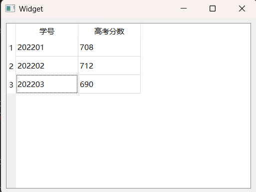

## Qt5 开发必备：Item Views 与 Item Widgets 控件全面解析

在 Qt 开发中，Item Views（项目视图）和 Item Widgets（项目部件）是构建界面数据展示模块的核心控件，它们分别基于模型 - 视图（Model-Based）和项 - 基于（Item-Based）两种设计模式，适用于不同的数据展示场景。本文将结合实例代码，详细拆解常用控件的功能、用法及核心差异，帮助开发者快速上手。

## 一、核心概念：Item Views 与 Item Widgets 的本质区别

在开始具体控件学习前，首先要明确两类控件的核心设计思想，这直接决定了它们的使用场景：

|     类型     |          设计模式          |                 核心特点                  |                      数据与界面关系                      |
| :----------: | :------------------------: | :---------------------------------------: | :------------------------------------------------------: |
|  Item Views  | 模型 - 视图（Model-Based） | 数据与界面分离，通过模型（Model）管理数据 | **模型负责存储数据，视图负责展示，修改数据只需操作模型** |
| Item Widgets |  项 - 基于（Item-Based）   |   数据与控件绑定，控件自带数据存储功能    | **数据直接存储在控件的项（Item）中，操作控件即操作数据** |

简单来说：Item Views 更灵活，适合复杂数据、大数据量或多视图共享数据的场景；Item Widgets 更轻量，适合简单数据展示，开发速度更快。

## 二、Item Views 常用控件详解（Model-Based）

Item Views 系列控件需配合模型（如 QStandardItemModel、QStringListModel 等）使用，核心控件包括 **List View、Tree View、Table View** 等。



### 1. List View（清单视图）

**功能**：单列数据展示，支持选择、排序等基础操作，需通过模型绑定数据。

**核心步骤**：

1. 创建数据列表（如 QStringList）；
2. 构建模型（如 QStringListModel）并绑定数据；
3. 将模型设置到 List View 中；
4. （可选）绑定点击事件响应。

**头文件声明（widget.h）**：

```cpp
#ifndef WIDGET_H
#define WIDGET_H
#include <QWidget>
#include <QListView>
#include <QStringListModel>
#include <QMessageBox>

QT_BEGIN_NAMESPACE
namespace Ui { class Widget; }
QT_END_NAMESPACE

class Widget : public QWidget
{
    Q_OBJECT
public:
    Widget(QWidget *parent = nullptr);
    ~Widget();
private:
    Ui::Widget *ui;
    QListView *listview1; // List View 实例
private slots:
    void SlotClickedFunc(const QModelIndex &index); // 点击响应槽函数
};
#endif // WIDGET_H
```

**实例代码**：

```cpp
// widget.cpp
#include "widget.h"
#include "ui_widget.h"
#include <QListView>
#include <QStringListModel>
#include <QMessageBox>

Widget::Widget(QWidget *parent)
    : QWidget(parent)
    , ui(new Ui::Widget)
{
    ui->setupUi(this);
    resize(450,250);
    // 1. 创建 List View 控件并设置位置大小
    listview1 = new QListView(this);
    listview1->setGeometry(20,20,240,160);
    
    // 2. 准备数据
    QStringList qlist;
    qlist.append("运动类：篮球、足球");
    qlist.append("娱乐类：看电影、写小说、听音乐");
    qlist.append("游戏类：五子棋、扑克牌、中国象棋");
    qlist.append("旅游类：国外旅游、国内旅游");
    
    // 3. 绑定模型与数据
    //让 QListView（视图）能够展示 QStringList（数据）
    QStringListModel *listmode = new QStringListModel(qlist);
    listview1->setModel(listmode);
    
    // 4. 绑定点击事件
    connect(listview1, SIGNAL(clicked(const QModelIndex)), this, SLOT(SlotClickedFunc(const QModelIndex)));
}

// 点击事件响应：弹出选中内容
void Widget::SlotClickedFunc(const QModelIndex &index)
{
    QMessageBox::information(NULL,"兴趣爱好","你选择的类型为：\n"+index.data().toString());
}
```



**补充：**

```cpp
QStringListModel *listmode = new QStringListModel(qlist);
```

- **`QStringListModel`**：这是 Qt 专门为 `QStringList`（字符串列表）设计的**模型类**，属于 Qt 模型 - 视图框架中的 “标准模型”，作用是 “包装” 字符串列表数据，让视图能识别和展示。
- **`new QStringListModel(qlist)`**：创建模型实例时，把你准备好的字符串列表 `qlist` 传入构造函数，相当于把原始数据 “存入” 模型中。
- **`listmode`**：是这个模型实例的指针，后续用来把模型绑定到视图。


### 2. Tree View（树视图）

**功能**：层级化数据展示（如目录、组织架构），支持多级节点嵌套，需通过 QStandardItemModel 构建层级数据。

**核心步骤**：

1. 创建 QStandardItemModel 模型并设置表头；
2. 构建多级节点（QStandardItem），通过 appendRow 实现嵌套；
3. 将模型绑定到 Tree View；
4. （可选）设置节点展开、选中状态等。

**头文件声明（mainwindow.h）**：

```cpp
#ifndef MAINWINDOW_H
#define MAINWINDOW_H
#include <QMainWindow>
#include <QStandardItemModel>

QT_BEGIN_NAMESPACE
namespace Ui { class MainWindow; }
QT_END_NAMESPACE

class MainWindow : public QMainWindow
{
    Q_OBJECT
public:
    MainWindow(QWidget *parent = nullptr);
    ~MainWindow();
private:
    Ui::MainWindow *ui;
public:
    void InitTreeViewFunc(); // 初始化树视图
    QStandardItemModel *sItemMode; // 树视图模型
};
#endif // MAINWINDOW_H
```

**实例代码（构建学校层级结构）**：

```cpp
// mainwindow.cpp
#include "mainwindow.h"
#include "ui_mainwindow.h"
#include <QStandardItemModel>

MainWindow::MainWindow(QWidget *parent)
    : QMainWindow(parent)
    , ui(new Ui::MainWindow)
{
    ui->setupUi(this);
    InitTreeViewFunc(); // 初始化树视图
}

// 树视图初始化函数
void MainWindow::InitTreeViewFunc()
{
    // 1. 创建模型并设置表头
    sItemMode = new QStandardItemModel(ui->treeView);
    sItemMode->setHorizontalHeaderLabels(QStringList()<<QStringLiteral("编号") << QStringLiteral("初中部|高中部"));
    
    // 2. 构建一级节点：初中部
    QList<QStandardItem*> item11;
    QStandardItem *item1 = new QStandardItem(QString::number(1));
    QStandardItem *item2 = new QStandardItem("初中部");
    item11.append(item1);
    item11.append(item2);
    sItemMode->appendRow(item11);
    
    // 3. 构建二级节点：一年级（嵌套到初中部）
    QList<QStandardItem*> item112;
    QStandardItem *item1121 = new QStandardItem(QString::number(2));
    QStandardItem *item1122 = new QStandardItem(QStringLiteral("一年级"));
    item112.append(item1121);
    item112.append(item1122);
    item1->appendRow(item112);
    
    // 4. 构建三级节点：一班、二班、三班（嵌套到一年级）
    QList<QStandardItem*> item1231;
    item1231.append(new QStandardItem(QString::number(3)));
    item1231.append(new QStandardItem(QStringLiteral("一班")));
    item1121->appendRow(item1231);
    
    QList<QStandardItem*> item1232;
    item1232.append(new QStandardItem(QString::number(3)));
    item1232.append(new QStandardItem(QStringLiteral("二班")));
    item1121->appendRow(item1232);
    
    QList<QStandardItem*> item1233;
    item1233.append(new QStandardItem(QString::number(3)));
    item1233.append(new QStandardItem(QStringLiteral("三班")));
    item1121->appendRow(item1233);
    
    // 5. 构建一级节点：高中部
    QList<QStandardItem*> item12;
    QStandardItem *item3 = new QStandardItem(QString::number(2));
    QStandardItem *item4 = new QStandardItem("高中部");
    item12.append(item3);
    item12.append(item4);
    sItemMode->appendRow(item12);
    
    // 6. 绑定模型到 Tree View
    ui->treeView->setModel(sItemMode);
}
```




### 3. Table View（表视图）

**功能**：多行列结构化数据展示（如表格数据），支持表头设置、列宽调整、排序、禁止编辑等功能。

**核心步骤**：

1. 创建 QStandardItemModel 模型并设置表头；
2. 通过 setItem 方法添加行数据；
3. 绑定模型到 Table View，设置列宽、编辑权限、排序规则；

**实例代码（学生成绩表）**：

```cpp
// mainwindow.cpp
#include "mainwindow.h"
#include "ui_mainwindow.h"
#include <QStandardItemModel>

MainWindow::MainWindow(QWidget *parent)
    : QMainWindow(parent)
    , ui(new Ui::MainWindow)
{
    ui->setupUi(this);
    InitTableViewFunc(); // 初始化表视图
}

// 表视图初始化函数
void MainWindow::InitTableViewFunc()
{
    // 1. 创建模型并设置表头
    QStandardItemModel *stuMode = new QStandardItemModel();
    stuMode->setHorizontalHeaderItem(0, new QStandardItem(QObject::tr("学号")));
    stuMode->setHorizontalHeaderItem(1, new QStandardItem(QObject::tr("姓名")));
    stuMode->setHorizontalHeaderItem(2, new QStandardItem(QObject::tr("性别")));
    stuMode->setHorizontalHeaderItem(3, new QStandardItem(QObject::tr("分数")));
    
    // 2. 绑定模型到 Table View 并设置列宽
    ui->tableView->setModel(stuMode);
    ui->tableView->setColumnWidth(0, 120); // 学号列宽120px
    
    // 3. 添加行数据
    stuMode->setItem(0, 0, new QStandardItem("2022001"));
    stuMode->setItem(0, 1, new QStandardItem("张三"));
    stuMode->setItem(0, 2, new QStandardItem("男"));
    stuMode->setItem(0, 3, new QStandardItem("714"));
    
    stuMode->setItem(1, 0, new QStandardItem("2022002"));
    stuMode->setItem(1, 1, new QStandardItem("小花"));
    stuMode->setItem(1, 2, new QStandardItem("女"));
    stuMode->setItem(1, 3, new QStandardItem("720"));
    
    stuMode->setItem(2, 0, new QStandardItem("2022003"));
    stuMode->setItem(2, 1, new QStandardItem("小妮"));
    stuMode->setItem(2, 2, new QStandardItem("女"));
    stuMode->setItem(2, 3, new QStandardItem("657"));
    
    // 4. 设置表格属性：禁止编辑 + 按分数降序排序
    ui->tableView->setEditTriggers(QAbstractItemView::NoEditTriggers);
    stuMode->sort(3, Qt::DescendingOrder); // 第3列（分数）降序
}
```




## 三、Item Widgets 常用控件详解（Item-Based）

**Item Widgets 系列控件无需单独创建模型，数据直接存储在控件的 Item 中**，使用更简洁，核心控件包括 List Widget、Tree Widget、Table Widget。



### 1. List Widget（清单控件）

**功能**：与 List View 类似，单列数据展示，但无需模型，直接通过 addItem/addItems 添加数据。

**实例代码（展示诗词内容）**：

```cpp
// widget.cpp
#include "widget.h"
#include "ui_widget.h"
#include <QListWidget>

Widget::Widget(QWidget *parent)
    : QWidget(parent)
    , ui(new Ui::Widget)
{
    ui->setupUi(this);
    // 1. 添加单个项（设置居中对齐）
    QListWidgetItem *qitem = new QListWidgetItem("沁园春.雪--作者:毛主席"); //标题
    ui->listWidget->addItem(qitem);
    qitem->setTextAlignment(Qt::AlignCenter | Qt::AlignVCenter);  //水平|垂直居中对齐
    
    // 2. 批量添加项
    QStringList slist;
    slist << "1:北国风光，千里冰封，万里雪飘。";
    slist << "2:望长城内外，惟余莽莽；大河上下，顿时滔滔。";
    ui->listWidget->addItems(slist);
}
```




### 2. Tree Widget（树形控件）

**功能**：与 Tree View 类似，层级化数据展示，但无需模型，**直接通过 QTreeWidgetItem 构建节点**。

**实例代码（展示高校学院结构）**：

直接进行放置节点到上一次节点，就可以实现添加

```cpp
// widget.cpp
#include "widget.h"
#include "ui_widget.h"
#include <QTreeWidget>

Widget::Widget(QWidget *parent)
    : QWidget(parent)
    , ui(new Ui::Widget)
{
    ui->setupUi(this);
    // 1. 构建一级节点：清华大学
    QTreeWidgetItem *topItem1 = new QTreeWidgetItem(ui->treeWidget);
    topItem1->setText(0, "清华大学");
    topItem1->setCheckState(0, Qt::Checked); // 设置勾选状态
    ui->treeWidget->addTopLevelItem(topItem1);
    
    // 2. 构建二级节点（清华大学下属学院）
    QTreeWidgetItem *item11 = new QTreeWidgetItem(topItem1);
    item11->setText(0, "清华大学建筑学院");
    item11->setCheckState(0, Qt::Checked);
    
    QTreeWidgetItem *item13 = new QTreeWidgetItem(topItem1);
    item13->setText(0, "清华大学土木学院");
    item13->setCheckState(0, Qt::Checked);
    
    // 3. 构建一级节点：北京大学
    QTreeWidgetItem *topItem2 = new QTreeWidgetItem(ui->treeWidget);
    topItem2->setText(0, "北京大学");
    topItem2->setCheckState(0, Qt::Checked);
    ui->treeWidget->addTopLevelItem(topItem2);
    
    // 4. 构建二级节点（北京大学下属学院）
    QTreeWidgetItem *item21 = new QTreeWidgetItem(topItem2);
    item21->setText(0, "北京大学数学科学学院");
    item21->setCheckState(0, Qt::Checked);
    
    // 5. 控件属性设置：隐藏表头 + 展开所有节点
    ui->treeWidget->setHeaderHidden(true);
    ui->treeWidget->expandAll();
}
```




### 3. Table Widget（表控件）

**功能**：与 Table View 类似，多行列结构化数据展示，无需模型，**直接设置行列数和项数据**。

**实例代码（高考分数表）**：

```cpp
// widget.cpp
#include "widget.h"
#include "ui_widget.h"
#include <QTableWidget>

Widget::Widget(QWidget *parent)
    : QWidget(parent)
    , ui(new Ui::Widget)
{
    ui->setupUi(this);
    // 1. 设置表格行列数（3行2列）
    ui->tableWidget->setRowCount(3);
    ui->tableWidget->setColumnCount(2);
    
    // 2. 设置表头
    QStringList slist;
    slist << "学号" << "高考分数";
    ui->tableWidget->setHorizontalHeaderLabels(slist);
    
    // 3. 准备数据
    QList<QString> strno = {"202201", "202202", "202203"};
    QList<QString> strscore = {"708", "712", "690"};
    
    // 4. 循环添加数据
    for(int i=0; i<3; i++)
    {
        int iCol = 0;
        // 添加学号
        QTableWidgetItem *pitem = new QTableWidgetItem(strno.at(i));
        ui->tableWidget->setItem(i, iCol++, pitem);
        // 添加分数
        ui->tableWidget->setItem(i, iCol, new QTableWidgetItem(strscore.at(i)));
    }
}
```




## 四、两类控件选型建议

1. 优先选 Item Widgets 的场景：

- **数据量小、结构简单（如少量选项列表、简单表格）；**
- **开发周期短，无需复杂数据交互；**
- **不需要多视图共享数据。**

1. 优先选 Item Views 的场景：

- **数据量大、结构复杂（如海量表格数据、多层级目录）；**
- **需多视图共享同一数据（如同一数据同时用列表和表格展示）；**
- **需自定义数据逻辑（如自定义排序、过滤、编辑规则）；**
- **后续可能扩展数据来源（如从数据库、文件加载数据）。**

## 五、总结

Qt 的 Item Views 和 Item Widgets 系列控件覆盖了绝大多数数据展示场景，核心差异在于 “**数据与界面是否分离**”。实际开发中，需根据数据复杂度、交互需求和扩展性选择合适的控件：简单场景用 Item Widgets 快速实现，复杂场景用 Item Views 保证灵活性。掌握本文中的控件用法和选型原则，能大幅提升 Qt 界面开发效率。