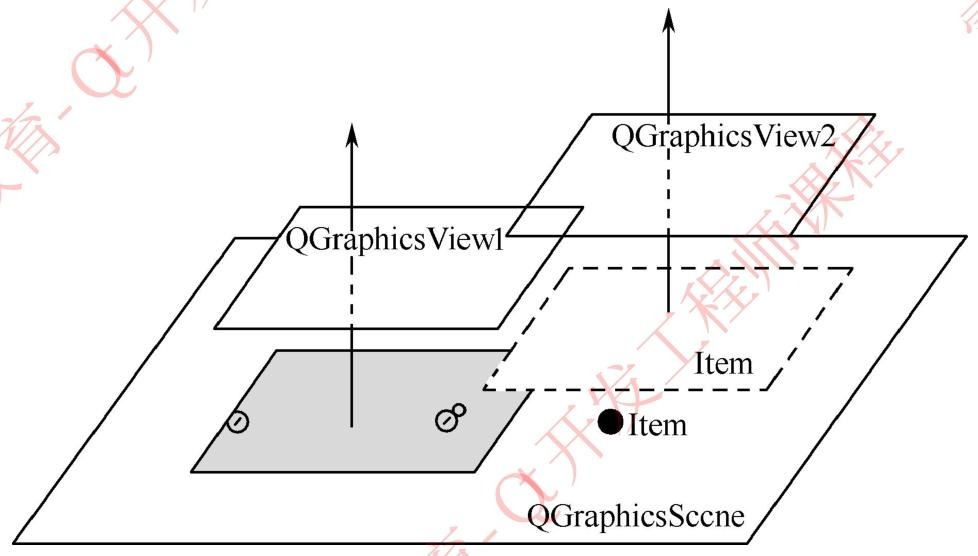
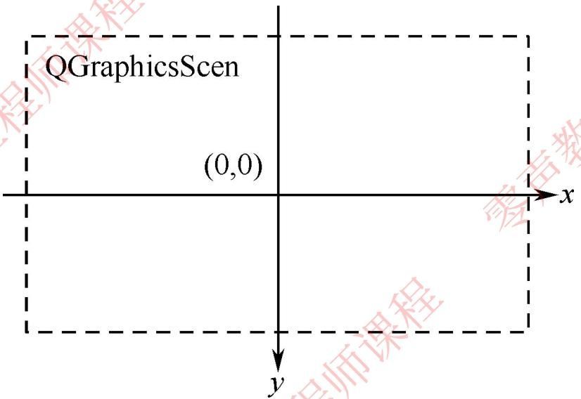
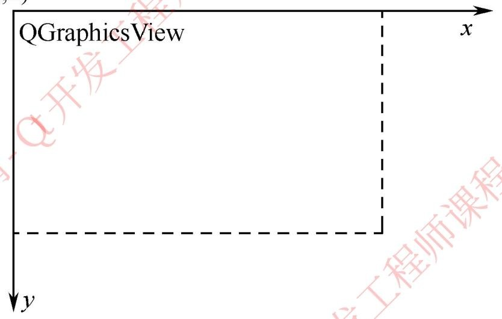
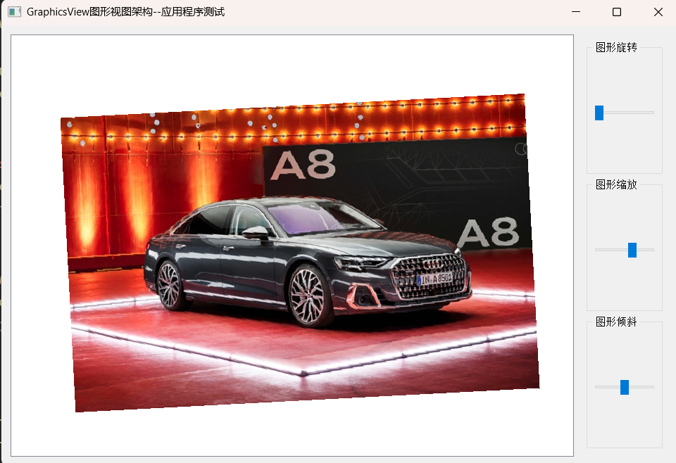

## Qt GraphicsView 框架：实现图形的旋转、缩放与倾斜

在 Qt 的图形开发领域，GraphicsView 框架占据着重要地位。它凭借场景（Scene）、视图（View）、图元（Item）三元素架构，为 2D 图形的展示与交互提供了强大支撑。通过这个案例**实现图形的旋转、缩放和倾斜功能**。

## 一、GraphicsView 框架核心三元素

GraphicsView 框架的核心是**场景（QGraphicsScene）、视图（QGraphicsView）、图元（QGraphicsItem）** 这三大组件，三者分工明确，协同工作。Qt 开发当中，绘图继承 QWidget 通过重写 paintEvent 虚函数来处理。
GraphicsView 绘图架构提供 2D 图形项目交互界面开发

1. **QGraphicsScene（场景）**

   - 场景是图元的容器，本身不可见。它的坐标系以中心为原点 (0,0)。

   - 主要负责管理所有添加到其中的图元，提供图元的添加、删除、查找等功能。

     简要理解作用：**图元的 “容器 + 管理中心”**

     - 存放所有图元（比如PixItem），是图元的 “大本营”；

     - 管理图元的位置、层级，提供图元查找 / 碰撞检测等能力；

     - 自身不可见，仅负责数据层面的管理

       

2. **QGraphicsView（视图）**

   - 视图继承自 QWidget，坐标系以窗口左上角为原点 (0,0)。

   - 它的作用是渲染显示场景中的图元，还支持 OpenGL 渲染来提升性能。

     简要理解作用：**场景的 “显示器 + 操作窗口”**

     1. 把场景里的图元渲染出来（让人可以看到）；

     2. 提供视图变换（旋转 / 缩放 / 倾斜）、滚动 / 拖拽视图等交互；

     3. 可多个视图绑定同一个场景（比如不同角度看同一批图元

        

3. **QGraphicsItem（图元）**

   - 图元是场景中可绘制的元素，是所有自定义图形项的基类。

   - 我们可以通过继承它来实现自定义的图形元素，比如本次案例中的图片图元。.jpeg)

     简要理解：作用就是

     **承载图形内容**：存储图片数据，通过 `paint()` 函数实现图片绘制，是连接图片与场景的桥梁。

     **定义图形边界**：重写 `boundingRect()` 确定绘制范围，支撑渲染优化和交互计算。

     **作为交互载体**：是旋转、缩放、倾斜等变换的操作目标，也可扩展实现拖拽、点击等高级交互。

   总之，三者关系就是**场景管图元（存、管），视图显场景（显、交互），图元载内容（画、交互载体）**

   

## 二、核心类设计与实现

本次案例需要实现图片的旋转、缩放、倾斜操作，主要涉及 4 个核心文件：自定义图元类（`pixitem.h/.cpp`）、主窗口类（`mainwidget.h/.cpp`）。

### 1. 自定义图元类：PixItem

该类继承自`QGraphicsItem`，用于加载并绘制图片。我们需要重写两个关键函数：`boundingRect()`和`paint()`。

- pixitem.h 头文件

  定义了 PixItem 类的成员变量和函数接口，包含用于存储图片的 QPixmap 对象，以及重写的边界矩形函数和绘制函数。

```cpp
#ifndef PIXITEM_H
#define PIXITEM_H
#include <QGraphicsItem>  // 引入QGraphicsItem基类，用于创建自定义图形项
#include <QPixmap>        // 引入QPixmap类，用于处理图片
#include <QPainter>       // 引入QPainter类，用于绘制图形

/**
 * @brief 自定义图片图元类
 * 继承自QGraphicsItem，用于在GraphicsView场景中显示图片
 * 重写了boundingRect()和paint()两个核心虚函数
 */
class PixItem : public QGraphicsItem
{
public:
    /**
     * @brief 构造函数
     * @param pixmap 传入的图片对象指针
     */
    PixItem(QPixmap *pixmap);

private:
    QPixmap pix;  // 存储要显示的图片

public:
    /**
     * @brief 重写boundingRect函数
     * 必须重写，用于定义图元的边界矩形（碰撞检测、绘制区域的依据）
     * @return 返回图元的边界矩形
     */
    QRectF boundingRect() const;

    /**
     * @brief 重写paint函数
     * 必须重写，用于绘制图元的具体内容
     * @param painter 绘制器对象，用于执行绘制操作
     * @param option 绘制选项（如状态、样式等）
     * @param widget 绘制所在的窗口部件（可为nullptr）
     */
    void paint(QPainter *painter, const QStyleOptionGraphicsItem *option, QWidget *widget);
};

#endif // PIXITEM_H
```

- pixitem.cpp 源文件

  实现了头文件中声明的函数。

  ```cpp
  boundingRect()
  ```

  函数定义了图元的边界范围，

  ```cpp
  paint()
  ```

  函数负责将图片绘制到场景中，绘制时将图片中心与图元原点对齐。

```cpp
#include "pixitem.h"

/**
 * @brief 构造函数实现
 * @param pixmap 传入的图片对象指针，将图片拷贝到类内成员变量
 */
PixItem::PixItem(QPixmap *pixmap)
{
    pix = *pixmap;  // 拷贝传入的图片到类内存储
}

/**
 * @brief 实现boundingRect函数
 * 定义图元的边界范围，为了避免图片边缘被裁剪，在图片尺寸基础上向外扩展2个像素
 * @return 图元的边界矩形（以图元中心为原点）
 */
QRectF PixItem::boundingRect() const
{
    // 计算边界：左=-2-图片宽/2，上=-2-图片高/2，宽=图片宽+4，高=图片高+4
    return QRectF(-2 - pix.width()/2, -2 - pix.height()/2, pix.width() + 4, pix.height() + 4);
}

/**
 * @brief 实现paint函数
 * 绘制图片，将图片的中心与图元的原点(0,0)对齐，保证旋转/缩放等变换以图片中心为基准
 * @param painter 绘制器对象
 * @param option 绘制选项（未使用）
 * @param widget 绘制所在部件（未使用）
 */
void PixItem::paint(QPainter *painter, const QStyleOptionGraphicsItem *option, QWidget *widget)
{
    // 绘制图片：起始坐标为(-图片宽/2, -图片高/2)，使图片中心与图元原点重合
    painter->drawPixmap(-pix.width()/2, -pix.height()/2, pix);
}
```

### 2. 主窗口类：MainWidget

主窗口类负责创建场景、视图、图元，以及控制图形变换的控件，实现旋转、缩放、倾斜的业务逻辑。

- mainwidget.h 头文件

  

  定义了主窗口的成员变量，包括视图对象、自定义图元对象、控制参数，以及对应的槽函数。

```cpp
#ifndef MAINWIDGET_H
#define MAINWIDGET_H
#include <QWidget>           // 引入QWidget基类，作为主窗口
#include <QGraphicsView>     // 引入QGraphicsView，用于显示场景
#include <QGraphicsScene>    // 引入QGraphicsScene，作为图元容器
#include <QFrame>            // 引入QFrame，用于包裹控制控件
#include <QHBoxLayout>       // 引入水平布局
#include <QVBoxLayout>       // 引入垂直布局
#include <QGroupBox>         // 引入分组框，用于分类显示控件
#include <QSlider>           // 引入滑块控件，用于调节参数
#include "pixitem.h"         // 引入自定义图片图元类
#include <math.h>            // 引入数学库，用于缩放计算

/**
 * @brief 主窗口类
 * 负责创建GraphicsView框架的核心组件（场景、视图、图元），
 * 并实现旋转、缩放、倾斜的控制逻辑
 */
class MainWidget : public QWidget
{
    Q_OBJECT  // 必须添加，支持信号槽机制

public:
    /**
     * @brief 构造函数
     * @param parent 父窗口指针（默认nullptr）
     */
    MainWidget(QWidget *parent = nullptr);
    ~MainWidget();  // 析构函数

public:
    /**
     * @brief 创建控制控件的函数
     * 用于创建旋转、缩放、倾斜的滑块控件及布局
     */
    void CreateControlFrameFunc();

private:
    int iAngle;          // 记录旋转角度的上一次值（用于增量旋转）
    qreal scalevalues;   // 记录缩放系数的上一次值（用于增量缩放）
    qreal leanvalues;    // 记录倾斜系数的上一次值（用于增量倾斜）
    QGraphicsView *view; // 视图对象，用于显示场景
    QFrame *controlframe;// 控制框架，包裹所有滑块控件
    PixItem *pixitem;    // 自定义图片图元对象

private slots:
    /**
     * @brief 旋转槽函数
     * @param val 滑块当前值，用于计算旋转角度增量
     */
    void rotateFunc(int);

    /**
     * @brief 缩放槽函数
     * @param val 滑块当前值，用于计算缩放系数
     */
    void scaleFunc(int);

    /**
     * @brief 倾斜槽函数
     * @param val 滑块当前值，用于计算倾斜系数
     */
    void leanFunc(int);
};

#endif // MAINWIDGET_H
```

- mainwidget.cpp 源文件

  完成主窗口的初始化，包括场景创建、图元添加、控件布局，以及信号槽的连接，同时实现了旋转、缩放、倾斜的具体逻辑。流程就是`创建场景->图元->视图`

```cpp
#include "mainwidget.h"

/**
 * @brief 主窗口构造函数
 * 初始化GraphicsView框架的核心组件，设置布局，连接信号槽
 * @param parent 父窗口指针
 */
MainWidget::MainWidget(QWidget *parent)
    : QWidget(parent)
{
    setWindowTitle("GraphicsView图形视图架构--应用程序测试");  // 设置窗口标题

    // 初始化控制参数的初始值（避免首次调节时计算异常）
    iAngle = 3;          // 旋转角度初始值
    scalevalues = 3;     // 缩放系数初始值
    leanvalues = 3;      // 倾斜系数初始值

    // 1. 创建场景对象
    QGraphicsScene *sence = new QGraphicsScene;
    // 设置场景的矩形范围（以场景中心为原点，左=-200，上=-200，宽=380，高=380）
    sence->setSceneRect(-200, -200, 380, 380);

    // 2. 创建自定义图片图元
    QPixmap *pixmap = new QPixmap("D:\\Desk\\1\\1.jpg");  // 加载本地图片（注意路径需替换为实际路径）
    pixitem = new PixItem(pixmap);               // 创建自定义图元对象
    sence->addItem(pixitem);                     // 将图元添加到场景中
    pixitem->setPos(0, 0);                       // 设置图元在场景中的位置（场景原点）

    // 3. 创建视图对象
    view = new QGraphicsView;
    view->setScene(sence);                       // 将场景绑定到视图
    view->setMinimumSize(800, 600);              // 设置视图最小尺寸，避免窗口过小

    // 4. 创建控制控件框架
    controlframe = new QFrame;
    CreateControlFrameFunc();  // 调用函数创建滑块控件

    // 5. 设置整体布局
    QHBoxLayout *hlayout = new QHBoxLayout;
    hlayout->addWidget(view);          // 左侧添加视图
    hlayout->addWidget(controlframe);  // 右侧添加控制控件
    setLayout(hlayout);                // 设置主窗口布局
}

MainWidget::~MainWidget()
{}

/**
 * @brief 旋转槽函数实现
 * 增量旋转：计算当前滑块值与上一次值的差值，作为旋转角度
 * @param val 滑块当前值（0-360）
 */
void MainWidget::rotateFunc(int val)
{
    // view->rotate()：传入的是旋转增量（相对旋转），而非绝对角度
    view->rotate(val - iAngle);
    iAngle = val;  // 更新上一次旋转值，为下一次计算做准备
}

/**
 * @brief 缩放槽函数实现
 * 等比例缩放：以1.1为基数，通过幂次计算缩放系数，保证缩放的均匀性
 * @param val 滑块当前值
 */
void MainWidget::scaleFunc(int val)
{
    qreal qs;  // 缩放系数（x/y方向一致，保证等比例）
    if (val > scalevalues)
    {
        // 滑块值增大：放大，系数=1.1^(当前值-上一次值)
        qs = pow(1.1, (val - scalevalues));
    }
    else
    {
        // 滑块值减小：缩小，系数=(1/1.1)^(上一次值-当前值)
        qs = pow(1.0/1.1, (scalevalues - val));
    }
    // view->scale(x系数, y系数)：等比例缩放传入相同值
    view->scale(qs, qs);
    scalevalues = val;  // 更新上一次缩放值
}

/**
 * @brief 倾斜槽函数实现
 * 水平倾斜：仅修改x方向的倾斜系数，y方向保持0（无倾斜）
 * @param val 滑块当前值
 */
void MainWidget::leanFunc(int val)
{
    // view->shear(x倾斜系数, y倾斜系数)：x系数越大，水平倾斜越明显
    view->shear((val - leanvalues)/2.0, 0);
    leanvalues = val;  // 更新上一次倾斜值
}

/**
 * @brief 创建控制控件的函数实现
 * 分别创建旋转、缩放、倾斜的滑块控件，并设置布局和信号槽连接
 */
void MainWidget::CreateControlFrameFunc()
{
    // ========== 1. 旋转滑块 ==========
    QSlider *rotatesilder = new QSlider;
    rotatesilder->setOrientation(Qt::Horizontal);  // 设置滑块为水平方向
    rotatesilder->setRange(0, 360);                // 设置范围：0-360度
    QHBoxLayout *rotatelayout = new QHBoxLayout;
    rotatelayout->addWidget(rotatesilder);
    QGroupBox *rotategroup = new QGroupBox("图形旋转");  // 分组框，标注功能
    rotategroup->setLayout(rotatelayout);

    // ========== 2. 缩放滑块 ==========
    QSlider *scalesilder = new QSlider;
    scalesilder->setOrientation(Qt::Horizontal);
    scalesilder->setRange(0, 2*scalevalues);  // 设置范围：0-6（初始值3的2倍）
    scalesilder->setValue(scalevalues);       // 设置初始值为3
    QHBoxLayout *scalelayout = new QHBoxLayout;
    scalelayout->addWidget(scalesilder);
    QGroupBox *scalegroup = new QGroupBox("图形缩放");
    scalegroup->setLayout(scalelayout);

    // ========== 3. 倾斜滑块 ==========
    QSlider *leansilder = new QSlider;
    leansilder->setOrientation(Qt::Horizontal);
    leansilder->setRange(0, 2*leanvalues);   // 设置范围：0-6（初始值3的2倍）
    leansilder->setValue(leanvalues);        // 设置初始值为3
    QHBoxLayout *leanlayout = new QHBoxLayout;
    leanlayout->addWidget(leansilder);
    QGroupBox *leangroup = new QGroupBox(tr("图形倾斜"));
    leangroup->setLayout(leanlayout);

    // ========== 4. 连接信号槽 ==========
    // 滑块值变化时，触发对应的槽函数
    connect(rotatesilder, SIGNAL(valueChanged(int)), this, SLOT(rotateFunc(int)));
    connect(scalesilder, SIGNAL(valueChanged(int)), this, SLOT(scaleFunc(int)));
    connect(leansilder, SIGNAL(valueChanged(int)), this, SLOT(leanFunc(int)));

    // ========== 5. 控制控件整体布局 ==========
    QVBoxLayout *vlayoutframe = new QVBoxLayout;
    vlayoutframe->addWidget(rotategroup);  // 添加旋转分组框
    vlayoutframe->addWidget(scalegroup);   // 添加缩放分组框
    vlayoutframe->addWidget(leangroup);    // 添加倾斜分组框
    controlframe->setLayout(vlayoutframe); // 设置控制框架的布局
}
```



## 三、功能实现原理

1. 旋转功能

   通过`QGraphicsView`的`rotate()`函数实现。每次滑动滑块时，计算当前值与上一次值的差值，以此差值作为旋转角度，实现图形的增量旋转。

2. 缩放功能借助`QGraphicsView`的`scale()`函数。设定缩放因子为 1.1 的幂次，滑块值增大时放大图形，减小时缩小图形，保证缩放的均匀性。

3. 倾斜功能利用`QGraphicsView`的`shear()`函数。通过计算滑块值的变化量，设置水平方向的倾斜因子，垂直方向保持不变，实现图形的水平倾斜。

## 四、总结

本文通过一个完整的实战案例，详细讲解了 Qt GraphicsView 框架的核心三元素，以及如何利用该框架实现图形的旋转、缩放和倾斜操作。从自定义图元的创建，到主窗口的布局与逻辑实现，每一步都清晰易懂。掌握这些知识后，你可以基于此扩展更多复杂的 2D 图形交互功能，比如图元的拖拽、碰撞检测等。